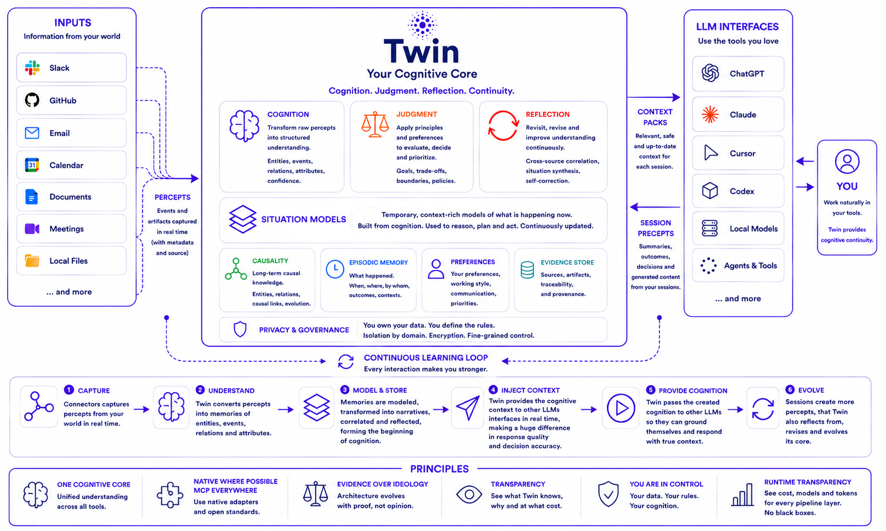

<p align="center">
  
</p>

<p align="center">
  <strong>Every AI should understand you better tomorrow than it did today — regardless of which AI you use.</strong>
</p>

<p align="center">
  <em>One cognitive core. Any model. Any interface.</em>
</p>

## Architecture (Sense → Cognize → Inject)

Twin is a **longitudinal Narrative** system with three hard walls:

| Module | Owns | Must not |
|---|---|---|
| **Sense** | Connectors, percepts, session residue absorb | Invent meaning without Cognize |
| **Cognize** | LLM-driven Situations → Reflections → Interpretations → Narrative Revision; human Commit Narrative / Stance | Speak to hosts as Inject; expand ACL beyond evidence |
| **Inject** | Domain Firewall, context packs, stale-as-fresh refusal, reserved Observer slot | Mutate Cognize substrate; serve stale as fresh |

There is no fourth “session mode.” Host conversations use Sense edges in and
Inject edges out. Durable product unit: **Narrative** + **EpistemicState**,
not a memory blob or a one-shot answer.

Operator TTY: bare `twin` opens the [Command Center](docs/COMMAND_CENTER.md).  
Pipeline detail: [ARCHITECTURE.md](docs/ARCHITECTURE.md) · [COGNIZE.md](docs/COGNIZE.md) · [EPISTEMICS.md](docs/EPISTEMICS.md).

<p align="center">
  <a href="docs/SETUP.md"></a>
  <a href="https://pypi.org/project/twin-cognition/"></a>
  <a href="docs/SETUP.md"></a>
  <a href="LICENSE"></a>
</p>

<p align="center">
  <a href="#purpose">Purpose</a> ·
  <a href="#the-problem">The Problem</a> ·
  <a href="#the-current-landscape">Landscape</a> ·
  <a href="#what-twin-is-trying-to-prove">Hypotheses</a> ·
  <a href="#demonstration">Demonstration</a> ·
  <a href="#current-findings">Findings</a> ·
  <a href="#where-to-aim">Where to Aim</a> ·
  <a href="#research-objective">Research</a> ·
  <a href="#product-objective">Product</a><br/>
  <a href="#runtime-philosophy">Runtime</a> ·
  <a href="#what-twin-is-not">What Twin Is Not</a> ·
  <a href="#direction">Direction</a> ·
  <a href="#relationship-to-similar-projects">Similar Projects</a> ·
  <a href="#evidence-over-ideology">Evidence</a> ·
  <a href="#success-criteria">Success</a> ·
  <a href="#final-objective">Final Objective</a> ·
  <a href="#install">Install</a> ·
  <a href="#docs">Docs</a> ·
  <a href="#license">License</a>
</p>

## Purpose

Twin exists to reduce the cognitive cost of repeatedly explaining the
same person, project, history, decisions and constraints to different AI
systems.

It is not another chatbot, another agent framework, another RAG pipeline
or another knowledge graph.

Its proposal is broader:

> **Build a persistent, governed and model-independent cognitive layer that transforms distributed observations into reusable understanding.**

That understanding should survive changes in models, interfaces,
providers and applications.

## The Problem

Modern AI systems are powerful but fragmented.

Information about the same real-world situation becomes scattered across
chats, source code, pull requests, meetings, emails, calendars and
documents. Each model, application and session receives only a partial
view of the person using it.

Most systems retrieve these pieces independently.

Few synthesize them into a coherent understanding of what actually
happened, why it happened, what changed, what was rejected, what is
still open and what should matter next — or when a conclusion remains
valid, what superseded it, which context may use it and how it should
influence a future decision.

Long context windows, product memory, retrieval systems and knowledge
graphs reduce repetition, but mostly improve access to stored
information. They do not by themselves maintain a coherent model of
meaning over time.

The deeper problem is therefore not simply storage or retrieval. It is
**cognitive continuity**: preserving an inspectable and useful
representation of a person across changing interfaces and intelligence
providers without surrendering privacy, ownership or authority.

The consequence of failing at that is repeated explanations,
inconsistent reasoning, context loss and dependence on product-specific
memory.

## The Current Landscape

Today's ecosystem already provides excellent solutions for individual
problems.

| Category | Primary optimization |
|---|---|
| Product memory | Convenience inside one assistant |
| RAG | Retrieval of relevant information |
| Knowledge graphs | Structured entities and relationships |
| Context engineering | Prompt quality and token efficiency |
| Agent frameworks | Planning and execution |
| Personal AI systems | Personal organization and assistance |
| Protocol access (e.g. MCP) | Standardized tool and context delivery |
| Local-first / self-hosted stacks | Ownership of data and runtime |

These developments validate the underlying need, but they also make weak
differentiation insufficient. Memory, graphs, connectors, agents and
context assembly are no longer novel in isolation. Twin should not
define its ambition as merely combining those features.

Twin does not compete by replacing these approaches.

It treats them as components of a broader cognitive process.

```text
Observation
    ↓
Percept
    ↓
Correlation
    ↓
Situation Formation
    ↓
Memory
    ↓
Understanding
    ↓
Reflection
    ↓
Memory
    ↓
Judgment
    ↓
Governed Context
    ↓
Any Authorized Intelligence
```

## What Twin Is Trying to Prove

Twin is guided by the following hypotheses:

1. **Understanding is more valuable than isolated retrieval.**
2. **Distributed observations can form coherent situation models.**
3. **Reflection should precede durable memory.**
4. **Judgment should evolve separately from factual memory.**
5. **Cognitive continuity depends more on reusable understanding than on context-window size.**
6. **A person's cognitive substrate should remain portable across models and vendors.**
7. **Governance must be applied before sensitive context reaches the reasoning model.**
8. **Inferred knowledge remains falsifiable.**

These hypotheses should be validated through reproducible experiments and benchmarks.

## Demonstration

The following demonstration shows Twin operating in a real-world scenario.

> **The objective is not to retrieve related artifacts. The objective is to synthesize reusable computational understanding.**

https://github.com/user-attachments/assets/9472cfdb-954a-4ed0-96a2-5e498147d92b

### The Situation

A product owner states in Slack that the product cannot be released without **Feature A**.

Later:

- a Pull Request implementing Feature A is opened;
- the Pull Request is merged;
- a Slack message announces that the feature has been merged.

None of these artifacts explicitly reference each other.

The Slack conversation never identifies the Pull Request.

The Pull Request never states that it resolves the Slack discussion.

### The Experiment

A completely new Claude conversation is started.

Claude has:

- no custom memory;
- no project-specific rules;
- no prior knowledge about the Dogwalker project;
- no manually written prompt describing the repository;
- no local files containing project information;

The only integration available is:

- Twin's MCP server;
- Twin's automatic context injection hooks.

When asked about the Dogwalker project, Claude explains the situation as a coherent narrative rather than retrieving isolated observations.

Instead of describing individual Slack messages or Pull Requests, it understands that:

- John identified Feature A as a launch blocker;
- Edu implemented the feature;
- the implementation resolved the blocker;
- the project state evolved as a consequence.

No manual reconstruction of the timeline is required.

### Why This Matters

This demonstration illustrates one of Twin's central hypotheses.

The value is not that an LLM receives more context.

The value is that it receives **better context**.

From the perspective of a traditional retrieval system, these are simply independent observations. And Twin never presented the downstream LLM with isolated observations. Instead, Twin had already correlated the evidence, reflected on it and synthesized reusable computational understanding.

**Twin therefore provides a coherent understanding of the situation rather than a collection of related artifacts.**

The downstream model spends fewer tokens reconstructing history and more tokens reasoning about the user's actual question.

This is the behavior Twin ultimately aims to generalize across conversations, repositories, documents, meetings, emails and every other authorized source of perception.

### The Scenario

The demonstration uses a public software project; [`caribeedu/dogwalker`](https://github.com/caribeedu/dogwalker).

- Source systems:
  - Slack
  - GitHub
- Reasoning model: **Claude Sonnet 4.6**

Approximately **1.7 million tokens** tokens were invested in ingesting and understanding formation; correlating commits, pull requests and conversations. The total processing cost for the experiment was approximately **US$10**.

## Current Findings

Twin is an active engineering research and product project.

The following observations are not presented as proven facts, but as
current findings obtained through iterative implementation and
experimentation.

They motivate the hypotheses described in the following section.

Current experiments suggest that:

- Distributed observations can be synthesized into reusable understanding rather than remaining isolated memories;
- Understanding can be significantly more valuable than retrieving raw observations during long-running conversations;
- Situation synthesis reduces the amount of context required by downstream LLMs;
- Reflection can improve understanding quality before durable memory is created;
- Explicit judgment appears more stable when modeled independently from factual memory;
- Frontier reasoning models currently produce substantially better understanding quality than contemporary local models for complex cognitive tasks;
- Exposing evidence, confidence and processing cost makes cognitive behavior significantly more inspectable than opaque memory systems;

These findings remain subject to revision.

Twin intentionally treats every architectural decision as provisional until
supported by broader experimentation and reproducible benchmarks.

## Where to Aim

Twin should aim to become an **open cognitive architecture and runtime
for a persistent, self-correcting digital counterpart**.

A digital counterpart is not a chatbot impersonating its owner and not
an autonomous clone. It is a user-controlled computational
representation that can preserve continuity, interpret relevant history,
support judgment and progressively act within explicit limits.

Beyond what happened, the long-term system should represent:

- how knowledge was acquired and how reliable it is;
- why a decision was made, including rejected alternatives;
- which assumptions, values and constraints influenced it;
- what outcome followed and whether later evidence changed the
  conclusion;
- which preferences are stable, contextual, aspirational or obsolete;
- where the system is uncertain or internally inconsistent;
- which parts of the model may be exposed for a given persona, purpose,
  domain and audience;
- which actions may be suggested, prepared or executed.

Models may propose interpretations, memories and revisions. Identity-level claims, durable judgment and delegated authority require proportionate evidence, transparency and human control.

## Research Objective

Its central question is:

> **How can software form, revise and reuse computational understanding
> over time?**

Answering that question requires combining software engineering with insights from:

- philosophy of mind;
- cognitive science;
- neuroscience;
- psychology;
- symbolic AI;
- knowledge graphs;
- human-computer interaction;
- cognitive architectures;
- causal reasoning;
- temporal reasoning;
- memory consolidation;
- reflection and judgment;

These disciplines are treated as sources of engineering hypotheses that
can be validated through implementation, benchmarks and experimentation.

Core research directions include:

| Direction | Focus |
|---|---|
| **Longitudinal identity** | An evolving history of roles, phases and context-dependent behavior — not a static profile flattened into one summary. |
| **Causal and decision memory** | Episodes that link context, evidence, alternatives, values, action, outcome and later reflection. |
| **Judgment modeling** | How the user evaluates trade-offs, kept distinct from factual memory, with scope, exceptions, confidence and revision. |
| **Epistemic self-correction** | Contradictions, supersession, stale beliefs, weak evidence and model disagreement — history preserved, current view defensible. |
| **Contextual identity and privacy** | What an authorized intelligence may know for a persona, purpose, domain and audience *before* reasoning begins. |
| **Model-independent continuity** | Memory, identity, judgment and permissions that survive replacement of every model, application and provider. |
| **Progressive agency** | From recall toward bounded delegation without collapsing understanding into action, or acting *as* the user by default. |

More on academic roots in [docs/FOUNDATIONS.md](docs/FOUNDATIONS.md).
Open research questions beyond the current loop are tracked in
[docs/RESEARCH.md](docs/RESEARCH.md#open-directions).

## Product Objective

In practical use, Twin should make authorized AI tools feel progressively less forgetful and less dependent on re-briefing.

A user should be able to open a new conversation in another tool and receive an answer grounded in prior understanding without manually reconstructing the history.

It should provide:

- evidence-backed memory;
- cross-source understanding;
- situation synthesis;
- understanding formation;
- reflection and revision;
- explicit judgment;
- privacy and governance before reasoning;
- transparent processing costs;
- model independence;
- exportability;
- human authority over durable conclusions and any delegated agency;

Users should always be able to inspect:

- what Twin concluded;
- why it concluded it;
- which evidence supports it;
- what it cost to compute;
- how confident the system is;
- what may be corrected, exported or removed;

Install and first use: [docs/SETUP.md](docs/SETUP.md). Product shape: [docs/PRODUCT.md](docs/PRODUCT.md).

## Runtime Philosophy

Twin was conceived with a strong local-first philosophy.

The long-term objective remains maximizing cognition on hardware owned
by the user.

Current experiments, however, show that advanced stages such as
cross-source correlation, situation synthesis, understanding formation,
reflection and judgment extraction currently achieve substantially
higher quality using frontier cloud models than contemporary local
models on consumer hardware.

Twin therefore adopts a pragmatic position:

- prefer local execution whenever quality is sufficient;
- use cloud reasoning where it demonstrably improves cognition;
- expose every processing stage;
- expose the computational cost of every cognitive layer;
- allow components to be replaced as local models improve;

The objective is not to maximize cloud usage.

The objective is computational understanding with complete transparency,
user control and a progressive path back to local execution as model
quality evolves.

## What Twin Is Not

Twin should not become:

- a proprietary assistant;
- a mandatory user interface;
- an indiscriminate life archive;
- a vector database presented as cognition;
- a system that treats every observation as truth;
- an autonomous actor that silently changes the user's values;
- a chatbot that impersonates the owner;
- a system that hides reasoning costs;
- a collection of cognitive terminology without measurable behavior;

## Direction

The current direction is to strengthen and validate the smallest complete
cognitive loop:

```text
Artifact
    ↓
Percept
    ↓
Correlation
    ↓
Situation Model
    ↓
Understanding
    ↓
Confirmed Memory
    ↓
Safe Context
```

This loop represents the minimum viable cognitive substrate.

Current implementations already demonstrate capabilities such as:

- cross-source correlation;
- situation synthesis;
- robust revision;
- contradiction resolution;
- longitudinal understanding;
- explicit reflection;
- judgment formation;
- cross-domain governance;

The next stage is to improve the quality, scalability and explainability of these capabilities through:

- stronger situation formation;
- richer causal reasoning;
- higher-quality understanding synthesis;
- quantitative benchmark coverage;
- lower cognitive and computational cost;
- progressively greater local execution as model capabilities mature;

The long-term direction is a persistent cognitive substrate capable of supporting any authorized intelligence while preserving continuity, evidence, privacy, governance and human authority.

> Every future capability should emerge from strengthening this loop rather than bypassing it.

Pipeline detail in [docs/ARCHITECTURE.md](docs/ARCHITECTURE.md). Planned work in [docs/ROADMAP.md](docs/ROADMAP.md).

## Relationship to Similar Projects

Twin shares ideas with several existing projects and research directions. It does not attempt to replace them, nor does it claim that they solve the wrong problems.

Instead, Twin investigates a different layer of the cognitive pipeline: the formation, revision and reuse of computational understanding.

Memory, retrieval, knowledge graphs, context engineering and agents are all treated as valuable implementation techniques rather than the final product.

| Project | Primary focus | How Twin differs |
|---|---|---|
| **OpenViking** | Context management, long-term memory infrastructure and efficient context delivery for AI systems. | Twin focuses on forming reusable understanding before context is assembled. Context becomes an output of cognition rather than the primary objective. |
| **Hermes** | Persistent memory, autonomous agents and long-running task execution. | Twin treats agents as consumers of computational understanding. Its primary focus is understanding formation, reflection, judgment and governed cognition. |
| **GBrain** | Personal knowledge graphs that continuously organize entities and relationships. | Twin goes beyond organizing knowledge by synthesizing situation models, causal relationships, reusable understanding and explicit judgment from distributed observations. |
| **LifeOS** | Personal organization of goals, notes, routines and life management. | Twin is not a productivity or life-management system. It aims to build a persistent cognitive substrate that any authorized intelligence can consult while preserving continuity, governance and human authority. |

These projects solve valuable and complementary problems.

## Evidence Over Ideology

Twin follows evidence over ideology.

Every architectural decision is expected to evolve as new evidence
emerges. Local execution, cloud reasoning, graph structures, memory
models and cognitive abstractions are implementation choices — not
dogma.

The project values measurable improvements in computational
understanding above adherence to any particular technology or paradigm.

This philosophy also applies to Twin itself: hypotheses should be
revised whenever stronger evidence appears. Architectural language is
only valuable when it produces behavior that can be tested.

## Success Criteria

Twin should be judged by observable cognitive behavior, not by the
number of integrations, graph nodes or stored documents.

It should measurably:

1. Reduce repeated explanations.
2. Produce correct cross-source understanding.
3. Preserve causal and temporal relationships — including rejected
   alternatives where they matter.
4. Form reusable situation models.
5. Distinguish observation, understanding, memory and judgment.
6. Revise previous understanding when stronger evidence appears, and
   explain which claim is current and why.
7. Expose uncertainty instead of presenting inference as fact.
8. Prevent unauthorized context leakage across personas, domains and
   audiences.
9. Maintain continuity across models and interfaces.
10. Remain transparent, inspectable and exportable — every durable part
    correctable or removable by the user.
11. Improve downstream reasoning while minimizing cognitive and
    computational cost.
12. Grow agency only within explicit human authority, and revise after
    observing outcomes of suggested or delegated actions.

Wherever possible, the project should publish repeatable scenarios,
failure cases and comparative evaluations against simpler memory and
retrieval baselines. Communication should lead with those demonstrated
outcomes — see [docs/IDENTITY.md](docs/IDENTITY.md#how-twin-should-be-spoken-about).

## Final Objective

Twin aims to build a persistent cognitive substrate that progressively transforms distributed observations into computational understanding, while preserving privacy, ownership, portability and human authority.

It should remain independent of any single model, interface or provider, allowing any authorized intelligence to understand the user's world with greater continuity over time.

## Docs

This README is the public destination statement. Deeper docs expand
concepts without hiding them.

### Product, architecture & ops

| Doc | Source of truth for |
|---|---|
| **[SETUP.md](docs/SETUP.md)** | Install, first-run wizard, providers, config, tests |
| **[OPERATIONS.md](docs/OPERATIONS.md)** | How to operate — demo scenario, connectors, meditate, native, review, recovery |
| **[ARCHITECTURE.md](docs/ARCHITECTURE.md)** | How Twin works — Sense → Cognize → Inject, data model, threat model |
| **[COGNIZE.md](docs/COGNIZE.md)** | Cognize pipeline stages (internal — not the public architecture) |
| **[EPISTEMICS.md](docs/EPISTEMICS.md)** | Freshness, independence, ACL on derived claims, read-time confidence |
| **[COMMAND_CENTER.md](docs/COMMAND_CENTER.md)** | Bare `twin` TTY operator surface (Services, Jobs, Cognize, …) |
| **[INTERFACES.md](docs/INTERFACES.md)** | How tools talk to Twin — [Native](docs/NATIVE.md), [MCP](docs/MCP.md), [CLI](docs/CLI.md), [REST](docs/REST.md) |
| **[PRODUCT.md](docs/PRODUCT.md)** | What Twin delivers — layers, domains, success criteria |
| **[ROADMAP.md](docs/ROADMAP.md)** | Planned work — next major versions |
| **[v2.md](docs/v2.md)** / **[v2-tracker.md](docs/v2-tracker.md)** | Twin v2 redesign journal + package-cut inventory (historical; prefer split docs above) |
| **[CHANGELOG.md](docs/CHANGELOG.md)** | What each release delivered |
| **[RESEARCH.md](docs/RESEARCH.md)** | Hypotheses, method, scenario benchmarks, open directions |

### Destination & framing

| Doc | Source of truth for |
|---|---|
| **[IDENTITY.md](docs/IDENTITY.md)** | What Twin is — unit of value, positioning, principles, how Twin is spoken about |
| **[GLOSSARY.md](docs/GLOSSARY.md)** | Shared vocabulary — Narrative, Reflection, Interpretation, Stance, … |

### Cognition concepts

| Doc | Source of truth for |
|---|---|
| **[COGNITION.md](docs/COGNITION.md)** | Understanding (emergent) and Situations — bridge from percepts to Narratives |
| **[FOUNDATIONS.md](docs/FOUNDATIONS.md)** | Appendix — academic roots (Extended Mind, 4E, …); inspiration, not claims |

## License

[MIT](LICENSE) © 2026 Edu Caribé
