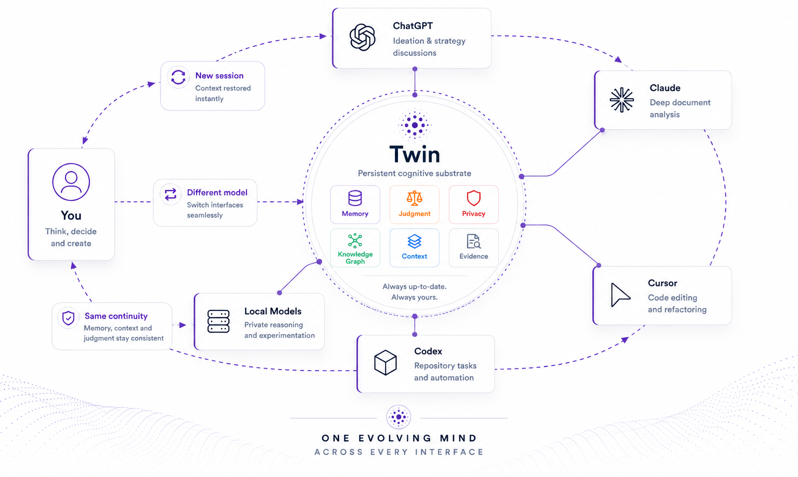
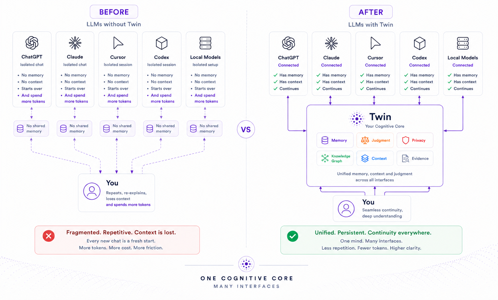

<p align="center">
  
</p>

<p align="center">
  <strong>Persistent cognitive infrastructure</strong> for LLM-powered tools<br/>
  — local memory, judgment, privacy and context through one portable core.<br/>
  For you, that core is a <strong>Personal Cognitive OS</strong>.
</p>

<p align="center">
  <em>Change the model. Change the interface. Keep the continuity.</em><br/>
  <em>Native where possible. MCP everywhere. One cognitive core.</em>
</p>

<p align="center">
  <a href="#how-to-use-twin"></a>
  <a href="docs/SETUP.md"></a>
  <a href="docs/CONNECTION.md"></a>
  <a href="LICENSE"></a>
</p>

<p align="center">
  <a href="#why-twin">Why</a> ·
  <a href="#how-it-works">How it works</a> ·
  <a href="#principles">Principles</a> ·
  <a href="#how-to-use-twin">How to use</a> ·
  <a href="#before--after">Before / After</a> ·
  <a href="#docs">Docs</a> ·
  <a href="#faq">FAQ</a>
</p>

---

## Why Twin?

Modern LLMs are powerful — and still forget who you are every new chat.

You re-explain projects, decisions, rejected alternatives, tone preferences and hard domain boundaries. Product “memory” and RAG help a little; they still retrieve **text**, not a durable substrate. The industry keeps solving memory; Twin targets **cognitive continuity** across models, tools and sessions.

Twin’s bet:

> Not building an AI that remembers you — building cognitive infrastructure that authorized tools can safely consult.

Philosophically, Twin follows the **extended mind** idea: reliable external tools can become part of how you think — if they stay available, auditable and under your control. Deep roots: [docs/FOUNDATIONS.md](docs/FOUNDATIONS.md).

Local store. Evidence-backed memories. Domain firewall. Evolving judgment. Context packs over MCP so Cursor, Claude, Codex and friends stop starting from zero.

---

## The problem

Even with long windows and product memory, users still repeat who they are, how they want answers, what was decided, which constraints hold and which domains must never mix.

For people who already know RAG, MCP and agents, the hard problem is not “stuff files into context”. It is:

> How do I create a persistent, safe, linkable, temporal representation of my mind/context so different LLMs need less explanation and more understanding?

Integration is not only low latency. What is missing is **operational understanding**: what a memory means, when it holds, which domain may use it and how it should affect a decision.

Twin’s concrete answer: store evidence-grounded memory locally, confirm what is trusted, let authorized LLM-powered tools pull a safe pack instead of asking you to re-explain.

---

## Vision

Long-term, Twin aims to work as a **personal exocortex**: continuity across tools, sessions, models and contexts — sober, local-first, auditable and incremental (aesthetic roots: [FOUNDATIONS](docs/FOUNDATIONS.md#aesthetic-inspiration)).

It should preserve important facts, decisions, rejected alternatives, tasks, preferences, judgment patterns, beliefs that change over time, relationships, evidence, hard domain boundaries, privacy and human control.

### What Twin is

**Infrastructure** first; **Personal Cognitive OS** as the product form; **exocortex** as the long-term experience.

A **local-first** layer of personal memory, judgment, privacy and context — queryable by authorized LLM-powered tools via **MCP**, a local HTTP API and a CLI.

> Not a chatbot. A substrate other tools consult.

It preserves facts, decisions, rejected alternatives, preferences, domain boundaries, evidence and human control — then ships **safe context packs** into the tools you already use.

Product shape and full roadmap: [docs/PRODUCT.md](docs/PRODUCT.md). Conceptual roots: [docs/FOUNDATIONS.md](docs/FOUNDATIONS.md).

### What Twin is not

Twin must not be understood as a chatbot, note-taking app, generic RAG, autonomous agent, vector-DB-of-markdown, Jarvis clone, or a UI meant to replace ChatGPT / Claude / Cursor.

**Non-goals:** not replacing those apps; not fine-tuning “you”; not archiving your entire life. Twin stays the substrate other tools consult.

**Why not RAG?** RAG retrieves relevant text; Twin assembles safe cognitive context for the next decision.

**Why not a vector database?** Vectors are indexes. The graph (memories, evidence, validity, domains, status) is truth. Wipe embeddings, `twin reindex`, keep the substrate.

### Final definition

Twin is a personal, local-first, interoperable and temporal layer of memory, judgment, privacy and context — so different LLMs can share a consistent representation of you without a re-brief every session.

> I don't want to just use an AI. I want to feel integrated with the machine, as if part of my cognition could exist outside my brain, with safety, continuity and control.

The MVP starts small: reliable technical memory via MCP. The destination is bigger: a personal, portable, private and evolving extended brain.

---

## How it works

<p align="center">
  
</p>

Twin does not treat raw files as “memory”. Cognition is layered:

| Concept | Role |
|---|---|
| **Percept** | Normalized capture from docs, sessions, connectors — evidence, not yet trusted memory |
| **Memory** | Confirmed (or candidate) compressed claim with type, domain, validity and evidence links |
| **Evidence** | Quotes / provenance that make memories auditable and rejectable |
| **Domain firewall** | Blocks cross-domain leakage **before** content reaches the LLM |
| **Judgment** | Evolving principles and trade-offs — not the same store as facts |
| **Persona** | Role lens (individual, developer, …) that scopes what may be retrieved |
| **Context pack** | Privacy-filtered pack an agent pulls instead of asking you to re-brief |
| **Observer** | Parallel recall / salience while a session runs |

Full pipeline, data model and threat model: [docs/ARCHITECTURE.md](docs/ARCHITECTURE.md). Domains and MVP shape: [docs/PRODUCT.md](docs/PRODUCT.md).

---

## Principles

These are the constitution. Features may change; these should not. Full list: [docs/ARCHITECTURE.md](docs/ARCHITECTURE.md#architecture-principles).

- **Knowledge is not understanding** — packs should explain *why* a fact matters now, not only that it matched.
- **Memory is compression** — keep what changes future action; do not archive life indiscriminately.
- **Artifact ≠ Percept ≠ Memory ≠ Judgment** — never collapse capture, claim, principle and action into one blob.
- **Evidence before memory** — durable claims need provenance you can inspect and reject.
- **The graph is truth; embeddings are indexes** — search aids retrieval; the graph is authoritative.
- **Firewall before reasoning** — filter by domain / persona / policy before the main LLM sees content.
- **Progressive cognition** — `observe → remember → understand → judge → suggest → act`; no unsafe jump to autonomy.
- **Native where possible, MCP everywhere** — one cognitive core; no proprietary silo per host.
- **Local-first + exportability** — default under `~/.twin`; leaving must stay easy (`twin export`).
- **Human approval for durable judgment** — memory can be frequent; judgment stays conservative.

---

## How to use Twin

Python 3.10+, a clone of this repo, and an MCP client (Cursor / Claude Code / Claude Desktop). SQLite is enough for day one — no Postgres required.

```bash
git clone https://github.com/caribeedu/twin.git
cd twin
python -m venv .venv && source .venv/bin/activate   # Windows: .venv\Scripts\activate
pip install -e ".[mcp]"     # add ,dev or ,api later if you want tests/API

twin init                   # creates ~/.twin + guided model setup
twin doctor                 # optional: store, policies, LLM, MCP configs
```

`twin init` is required before anything else — until it runs there is no home and no store. The wizard configures chat + embeddings (Ollama recommended; Anthropic, Gemini and OpenAI-compatible are opt-in). Details: [docs/SETUP.md](docs/SETUP.md).

### Put knowledge in (and confirm it)

Twin does not invent durable facts for you. Ingest evidence, extract candidates, **confirm** what should be trusted. Context packs default to confirmed memories only.

```bash
twin ingest ./examples/docs   # or your own notes/docs
twin extract                  # needs a reachable chat model, or TWIN_EXTRACTOR=echo
twin review                   # accept the solid decision; reject noise
```

Check without an LLM:

```bash
twin search "webhook outbox" --domain technical
twin pack "retry strategy for Atlas webhooks" --domain technical
```

### Connect an LLM client over MCP

```bash
twin setup mcp cursor          # or: claude-code | claude-desktop
```

Restart / reload MCP. Twin should appear as a local server running `twin mcp`. Full interfaces + per-client setup: [docs/CONNECTION.md](docs/CONNECTION.md).

### First visible result

Open a **new** chat. Do **not** paste the RFC. Ask something only Twin’s memory can answer:

> For Atlas webhooks, what delivery approach did we already decide on, and what did we reject?

A well-wired client calls `memory_safe_context_pack` or `session_start` with `target_domain=technical`, receives your confirmed decision, and answers with the outbox/Postgres choice (Kafka rejected) — even though you never typed that in the chat.

```text
documents / sessions
  → ingest + extract
  → you confirm what is trusted
  → MCP context pack
  → LLM answers with less re-explanation
```

If the model still asks you to explain from scratch: memory must be `confirmed`, MCP tools enabled, and the client must request a pack with the right domain.

**Next:** keep ingesting your docs or complete MCP sessions (`session_start` → work → `session_complete`); `twin setup postgres` when you outgrow SQLite; daily ops via CLI or `twin serve` — see [docs/SETUP.md](docs/SETUP.md) and [docs/OPERATIONS.md](docs/OPERATIONS.md).

---

## Before / After

<p align="center">
  
</p>

That loop is the product promise in miniature.

---

## Roadmap

Read end-to-end in **one place**: [docs/PRODUCT.md — Roadmap](docs/PRODUCT.md#roadmap).

| Era | Focus |
|---|---|
| **v0.1 → v0.8** | Technical memory → sessions → quality → judgment → privacy → connectors → interpretation → consolidation |
| **v0.9** | Cognitive OS spine (runtime, formation, packs, attention, sovereignty, release gates) |
| **v1.0** | Daily-usable Personal Cognitive OS bar |
| **v1.1.0** | Adoption DX — guided setup, mainstream LLM providers, docs + local UI polish |
| **v2+** | Extended brain, automation, multimodal life, embodied memory — still progressive, still local-first |

---

## Docs

This README is the **overview**: problem, solution, architecture sketch and quickstart. Deeper docs do not hide ideas — they expand them. Prefer **one source of truth** per topic; do not fork the same page into four places.

| Doc | Source of truth for |
|---|---|
| **[docs/FOUNDATIONS.md](docs/FOUNDATIONS.md)** | Why Twin exists — Extended Mind, 4E, academic inspirations |
| **[docs/PRODUCT.md](docs/PRODUCT.md)** | What Twin delivers — layers, domains, MVP, **full roadmap** |
| **[docs/ARCHITECTURE.md](docs/ARCHITECTURE.md)** | How Twin works — principles, pipeline, data model, observer, threat model |
| **[docs/CONNECTION.md](docs/CONNECTION.md)** | How tools talk to Twin — MCP / CLI / API, native + MCP identity |
| **[docs/SETUP.md](docs/SETUP.md)** | How you install Twin — providers, config, tests |
| **[docs/OPERATIONS.md](docs/OPERATIONS.md)** | How you operate Twin — runtime, backup, incidents |

---

## FAQ

**Do I need the cloud?**  
No. Default path is local Ollama + SQLite. Cloud providers are opt-in.

**Is Twin another RAG app?**  
No. Retrieval is one step; firewall, evidence, temporality and judgment are the product.

**Is Twin a vector database?**  
No. Embeddings help search; the temporal graph is authoritative ([docs/ARCHITECTURE.md](docs/ARCHITECTURE.md#the-graph-is-truth-embeddings-are-indexes)).

**Which LLM providers work?**  
Ollama (recommended), Anthropic, Gemini, OpenAI and any OpenAI-compatible gateway (Groq, OpenRouter, LM Studio, vLLM, …). See [docs/SETUP.md](docs/SETUP.md).

**Where does my data live?**  
Under `~/.twin` (or `$TWIN_HOME`). Export with `twin export`. Backup = copy the folder.

**Can I leave later?**  
Yes — exportability is a first-class architecture principle ([docs/ARCHITECTURE.md](docs/ARCHITECTURE.md#exportability-over-lock-in)).

**Does Anthropic do embeddings?**  
No. Pair Claude chat with Ollama / OpenAI-compatible / Gemini / hash embeddings.

---

## Contributing

Issues and PRs welcome. Prefer small, reviewable changes that preserve local-first defaults, firewall-before-LLM and evidence-backed memory.

```bash
pip install -e ".[dev]"
python -m pytest
```

Read [docs/ARCHITECTURE.md](docs/ARCHITECTURE.md) (principles) and [docs/PRODUCT.md](docs/PRODUCT.md) before large design swings.

---

## License

[MIT](LICENSE) © 2026 Edu Caribé
