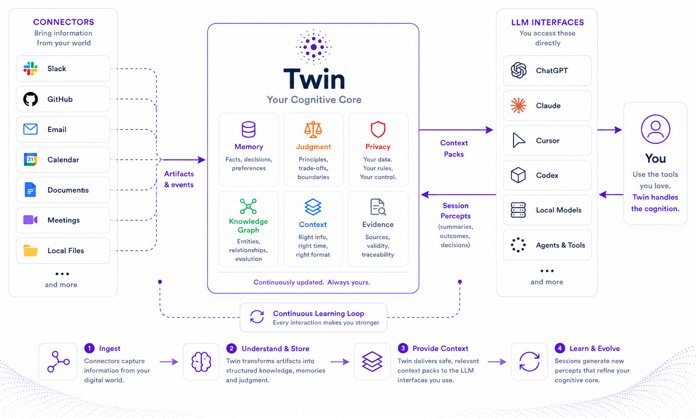

<p align="center">
  
</p>

<p align="center">
  <strong>Every AI should understand you better tomorrow than it did today — regardless of which AI you use.</strong><br/><br/>
  <strong>Personal Cognitive Layer</strong> for the LLM-powered tools you already use.<br/>
  One local source of memory, judgment, privacy and context — your cognitive core<br/>
  across models and interfaces.
</p>

<p align="center">
  <em>Change the model. Change the interface. Keep the continuity.</em><br/>
  <em>Native where possible. MCP everywhere. One cognitive core.</em>
</p>

<p align="center">
  <a href="#how-to-use"></a>
  <a href="docs/SETUP.md"></a>
  <a href="LICENSE"></a>
</p>

<p align="center">
  <a href="#why-twin">Why</a> ·
  <a href="#what-twin-does">What it does</a> ·
  <a href="#vision">Vision</a> ·
  <a href="#how-it-works">How it works</a> ·
  <a href="#principles">Principles</a> ·
  <a href="#how-to-use">How to use</a> ·
  <a href="#docs">Docs</a> ·
  <a href="#faq">FAQ</a>
</p>

---

## Why Twin?

Modern LLMs are powerful — and still start from zero whenever you open a new chat, switch models or change tools.

You re-explain projects, decisions, rejected alternatives, tone preferences, constraints and hard domain boundaries. Product memory and RAG reduce repetition, but usually remain tied to one product or retrieve fragments of text without maintaining a durable, governed representation of what they mean.

Twin targets **cognitive continuity** across models, tools and sessions.

> Not an AI that merely remembers you — a persistent cognitive layer that authorized tools can safely consult.

Twin starts from the human rather than from a single assistant. It builds a portable, local-first substrate for evidence, memory, judgment, privacy and context, so different LLM-powered tools can progressively understand you without owning your identity or locking your cognition into a proprietary silo.

Local store. Evidence-backed memories. Domain firewall. Evolving judgment. Context packs over MCP so Cursor, Claude, Codex and friends stop starting from zero.

Twin draws on philosophy of mind, cognitive science, neuroscience, psychology, symbolic AI, knowledge graphs, human-computer interaction and cognitive architectures. The objective is a reliable external tool that can become part of how you think while remaining available, auditable and under your control. More inspiration in [docs/FOUNDATIONS.md](docs/FOUNDATIONS.md).

---

## The problem

Even with long windows and product memory, users still repeat who they are, how they want answers, what was decided, which constraints hold and which domains must never mix.

For people who already know RAG, MCP and agents, the hard problem is not “stuff files into context”. It is:

> How do I create a persistent, safe, linkable and temporal representation of my context so different LLMs need less explanation and gain more operational understanding?

Integration is not only low latency. What is missing is **operational understanding**: what a memory means, when it holds, which domain may use it and how it should affect a decision.

Twin’s concrete answer is to store evidence-grounded memory locally, distinguish what was observed from what is trusted, and let authorized LLM-powered tools pull a safe pack instead of asking you to re-explain.

---

## Vision

<p align="center">
  
</p>

Long-term, Twin aims to work as a **personal exocortex**: continuity across tools, sessions, models and contexts — sober, local-first, auditable and incremental (aesthetic roots in [FOUNDATIONS](docs/FOUNDATIONS.md#aesthetic-inspiration)).

It should preserve important facts, decisions, rejected alternatives, tasks, preferences, judgment patterns, beliefs that change over time, relationships, evidence, hard domain boundaries, privacy and human control.

The destination is not a larger archive or a more autonomous chatbot. It is an open cognitive architecture for a persistent, self-correcting digital counterpart that can recall, understand, support judgment and eventually represent or act within explicit human authorization.

### What Twin is

**Infrastructure** first; **Personal Cognitive OS** as the product form; **exocortex** as the long-term experience.

A **local-first** layer of personal memory, judgment, privacy and context — queryable by authorized LLM-powered tools via **MCP**, a local HTTP API and a CLI.

> Not a chatbot. A substrate other tools consult.

It preserves facts, decisions, rejected alternatives, preferences, domain boundaries, evidence and human control — then ships **safe context packs** into the tools you already use.

Product shape in [docs/PRODUCT.md](docs/PRODUCT.md).

### What Twin is not

Twin must not be understood as a chatbot, note-taking app, generic RAG, autonomous agent, vector-DB-of-markdown, Jarvis clone, or a UI meant to replace ChatGPT / Claude / Cursor.

**Non-goals:** not replacing those apps; not fine-tuning “you”; not archiving your entire life. Twin stays the substrate other tools consult.

**Why not RAG?** RAG retrieves relevant text; Twin assembles safe cognitive context for the next decision.

**Why not a vector database?** Vectors are indexes. The graph — memories, evidence, validity, domains and status — is the canonical store. Wipe embeddings, run `twin reindex`, keep the substrate.

### Principles

These are the constitution. Features may change; these should not. Learn more about them in [docs/ARCHITECTURE.md](docs/ARCHITECTURE.md#architecture-principles).

- **Knowledge is not understanding** — packs should explain *why* a fact matters now, not only that it matched.
- **Memory is compression** — keep what changes future action; do not archive life indiscriminately.
- **Artifact ≠ Percept ≠ Memory ≠ Judgment** — never collapse capture, claim, principle and action into one blob.
- **Evidence before memory** — durable claims need provenance you can inspect and reject.
- **The graph is canonical; embeddings are indexes** — search aids retrieval; the graph is the source of truth.
- **Firewall before reasoning** — filter by domain / persona / policy before the main LLM sees content.
- **Progressive cognition** — observe, remember, understand, judge, suggest, then act; no unsafe jump to autonomy.
- **Native where possible, MCP everywhere** — one cognitive core; no proprietary silo per host.
- **Local-first + exportability** — default under `~/.twin`; leaving must stay easy (`twin export`).
- **Human approval for durable judgment** — memory can be frequent; judgment stays conservative.
- **Model independence** — cognition must survive model, vendor and interface replacement.
- **Self-correction over accumulation** — memories and beliefs should remain revisable when stronger evidence appears.

### Measuring success

Twin should not be evaluated by how many features, connectors or cognitive terms it contains.

Every release should answer:

> Does this reduce the amount of explanation a person must give an AI while increasing correctness, safety and continuity?

A meaningful change should strengthen at least one of these outcomes:

- cognitive continuity;
- understanding rather than retrieval;
- evidence and self-correction;
- human governance;
- privacy and domain separation;
- portability and interoperability;
- consistent judgment across tools;
- lower dependence on any single model or application.

### Final definition

Twin is open-source, local-first cognitive infrastructure: a personal, interoperable and temporal layer of memory, judgment, privacy and context shared across authorized LLM-powered tools — so you do not re-brief every session.

> I don't want to just use an AI. I want to feel integrated with the machine, as if part of my cognition could exist outside my brain, with safety, continuity and control.

The initial implementation started small: reliable technical memory via MCP. The destination is bigger: a personal, portable, private and evolving extended brain.

---

## How it works

<p align="center">
  
</p>

Twin does not treat raw files as “memory”. The cognitive pipeline is:

**Artifact → Percept → Candidate Memory → Confirmed Memory → Judgment → Action**

For a first pass, that loop reads as three stages:

1. **Obtain** — Twin captures sources as *artifacts* (docs you ingest, [connectors](#connectors) like Slack/GitHub, and **session notes** from LLMs). Sensors normalize them into **Percepts**: what was seen, with provenance — not yet trusted knowledge.
2. **Form** — A cognitive interpreter reads percepts and proposes **Candidate Memories** (decisions, facts, preferences, …) with **Evidence** quotes. You review and confirm what should be trusted. **Judgment** (how you decide) stays separate from facts. The graph is the canonical store; embeddings are only search indexes.
3. **Serve** — When you work in an LLM-powered tool, Twin builds a **safe context pack** by running hybrid retrieval, applying the **domain firewall** and persona policies, then assembling a compact pack. **Prefer native** when the host can embed Twin. **MCP** is the universal tool surface everywhere else — and still useful mid-task alongside native. CLI and `twin serve` use the same store.

| Concept | Role |
|---|---|
| **Percept** | Normalized capture — evidence, not yet trusted memory |
| **Memory** | Compressed, evidence-backed claim (candidate to confirmed) |
| **Evidence** | Quotes / provenance you can audit and reject |
| **Domain firewall** | Blocks cross-domain leakage **before** content reaches the model |
| **Judgment** | How you tend to decide — separate from facts |
| **Persona** | Role lens that scopes what may be retrieved |
| **Context pack** | Privacy-filtered pack a tool pulls instead of a re-brief |
| **Observer** | Parallel recall while a session runs |

Full pipeline, data model and threat model in [docs/ARCHITECTURE.md](docs/ARCHITECTURE.md). Domains and product shape in [docs/PRODUCT.md](docs/PRODUCT.md). Interfaces in [docs/INTERFACES.md](docs/INTERFACES.md).

### Connectors

Connectors pull sources into Twin **incrementally** (artifacts, then percepts, then candidates). They never auto-confirm Memory or Judgment. After sync, run `twin extract` and `twin review`.

| Connector | What Twin pulls today |
|---|---|
| **GitHub** | Chosen repos: issues and comments, PRs (reviews + review comments), default-branch commits, releases, CI status summaries — not diffs or file bytes |
| **Slack** | Chosen channels: messages and thread replies (text); file names/links as metadata only — not file bytes; DMs/private off by default |
| **Gmail** | Chosen labels: mail subjects, parties, and body text; attachments as metadata only |
| **Outlook** | Chosen folders: same mail shape as Gmail via Microsoft Graph |
| **Google Calendar** | Chosen calendars: events (title, time, people, description) — or free/busy only when configured that way |
| **Fireflies** | Meeting manifests, speaker-labeled transcript chunks, provider summaries — not audio/video |
| **Local folder** | Watched roots of text notes (Markdown/txt/…): document chunks on change; binaries stay metadata-only |

Ownership and vaults keep personal vs work data separable. Auth, config, discovery helpers and webhooks in **[connectors](docs/INTERFACES.md#connectors)**. Day-2 ops in [docs/OPERATIONS.md](docs/OPERATIONS.md).

---

## How to use

Python 3.10+, a clone of this repo, and an MCP client (Cursor / Claude Code / Claude Desktop). SQLite is enough for day one — no Postgres required.

### 1. Install and initialize

```bash
git clone https://github.com/caribeedu/twin.git
cd twin
python -m venv .venv && source .venv/bin/activate   # Windows: .venv\Scripts\activate
pip install -e ".[mcp]"     # add ,dev or ,api later if you want tests/API

twin init                   # creates ~/.twin + guided model setup
twin doctor                 # optional: store, policies, LLM, MCP configs
```

`twin init` is required before anything else — until it runs there is no home and no store. The wizard configures chat + embeddings (Ollama recommended; Anthropic, Gemini and OpenAI-compatible are opt-in). Details in [docs/SETUP.md](docs/SETUP.md).

### 2. Put knowledge in (and confirm it)

Twin does not invent durable facts for you. Ingest evidence, extract candidates, **confirm** what should be trusted. Context packs default to confirmed memories only.

```bash
twin ingest ./examples/docs   # or your own notes/docs
twin extract                  # needs a reachable chat model, or TWIN_EXTRACTOR=echo
twin review                   # accept the solid decision; reject noise
```

Check without an LLM:

```bash
twin search "webhook outbox" --domain technical
twin pack "retry strategy for Atlas webhooks" --domain technical
```

### 3. Connect an LLM client over MCP

```bash
twin setup mcp cursor          # or: claude-code | claude-desktop
```

Restart / reload MCP. Twin should appear as a local server running `twin mcp`. Full interfaces with per-client setup in [docs/INTERFACES.md](docs/INTERFACES.md).

### 4. See a first result

Open a **new** chat (or any connected agent in the terminal). Do **not** paste the RFC. Ask something only Twin’s memory can answer:

> For Atlas webhooks, what delivery approach did we already decide on, and what did we reject?

A well-wired client calls `memory_safe_context_pack` or `session_start` with `target_domain=technical`, receives your confirmed decision, and answers with the outbox/Postgres choice (Kafka rejected) — even though you never typed that in the chat. You should see something like:

<p align="center">
  
</p>

> [!NOTE]
> If the model still asks you to explain from scratch: memory must be `confirmed`, MCP tools enabled, and the client must request a pack with the right domain.

---

## Docs

This README is the **overview**: problem, solution, architecture sketch and quickstart. Deeper docs do not hide ideas — they expand them.

| Doc | Source of truth for |
|---|---|
| **[docs/FOUNDATIONS.md](docs/FOUNDATIONS.md)** | Why Twin exists — Extended Mind, 4E, academic inspirations |
| **[docs/PRODUCT.md](docs/PRODUCT.md)** | What Twin delivers — layers, domains, initial concepts, success criteria |
| **[docs/ROADMAP.md](docs/ROADMAP.md)** | Planned work — correlation depth, next major versions |
| **[docs/CHANGELOG.md](docs/CHANGELOG.md)** | What each release delivered — v0.1 through nowadays |
| **[docs/ARCHITECTURE.md](docs/ARCHITECTURE.md)** | How Twin works — principles, pipeline, data model, observer, threat model |
| **[docs/INTERFACES.md](docs/INTERFACES.md)** | How tools talk to Twin — Native, MCP, CLI, API, connectors |
| **[docs/SETUP.md](docs/SETUP.md)** | How you install Twin — providers, config, tests |
| **[docs/OPERATIONS.md](docs/OPERATIONS.md)** | How you operate Twin — runtime, backup, incidents |

---

## FAQ

### How is Twin different from RAG, knowledge graphs and agent frameworks?

Twin does not compete with those approaches. It builds on top of them.

Most existing projects optimize a specific capability:

| Existing approach | What it optimizes | What remains unresolved |
|---|---|---|
| Product memory | Convenience inside one assistant | Portability, governance and cross-tool continuity |
| RAG | Retrieving relevant text | Meaning, validity, judgment and authorization |
| Knowledge graphs | Structured entities and relationships | How knowledge should affect a person's decisions |
| Context engineering | Better prompts and lower token use | Persistent identity and cognition across interfaces |
| Agent frameworks | Planning and task execution | Human-centered continuity and governed representation |
| **Twin** | Persistent computational cognition | Integrates these capabilities under one controlled substrate |

Twin uses retrieval, graphs, context engineering and agent integrations where appropriate. The difference is that they are implementation techniques, not the product itself.

The objective is not to build another assistant, another graph database or another agent framework.

The objective is to provide a persistent cognitive layer that any authorized AI can consult.

### Is Twin another RAG app?
No. Retrieval is one step; firewall, evidence, temporality and judgment are the product.

### Is Twin a vector database? 
No. Embeddings help search; the temporal graph is authoritative ([docs/ARCHITECTURE.md](docs/ARCHITECTURE.md#the-graph-is-truth-embeddings-are-indexes)).

### Do I need the cloud? 
No. Default path is local Ollama + SQLite. Cloud providers are opt-in.

### Which LLM providers work? 
Ollama (recommended), Anthropic, Gemini, OpenAI and any OpenAI-compatible gateway (Groq, OpenRouter, LM Studio, vLLM, …). See [docs/SETUP.md](docs/SETUP.md).

### Does Anthropic do embeddings? 
No. Pair Claude chat with Ollama / OpenAI-compatible / Gemini / hash embeddings.

### Does Twin share my data? 
No Twin cloud and no analytics phone-home. Memory stays on your machine. Nothing is sent to a provider unless **you** configure a cloud LLM or embedder for extract/search — and even then the Domain Firewall decides what may enter a context pack before any model sees it. Cross-domain leaks are blocked locally, not trusted to the LLM. Details in [docs/ARCHITECTURE.md](docs/ARCHITECTURE.md#firewall-before-reasoning) and [docs/PRODUCT.md](docs/PRODUCT.md#domain-separation).

### Where does my data live? 
Under `~/.twin` (or `$TWIN_HOME`). Export with `twin export`.

### Can I leave later? 
Yes — exportability is a first-class architecture principle ([docs/ARCHITECTURE.md](docs/ARCHITECTURE.md#exportability-over-lock-in)).

---

## Contributing

Issues and PRs welcome. Prefer small, reviewable changes that preserve local-first defaults, firewall-before-LLM and evidence-backed memory.

```bash
pip install -e ".[dev]"
python -m pytest
```

Read [docs/ARCHITECTURE.md](docs/ARCHITECTURE.md) and [docs/PRODUCT.md](docs/PRODUCT.md) before large design swings.

---

## License

[MIT](LICENSE) © 2026 Edu Caribé
