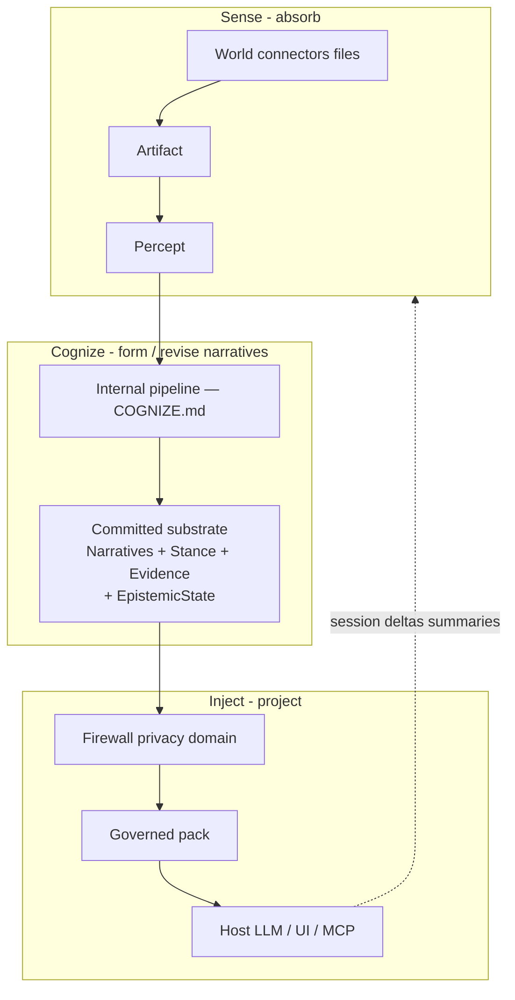
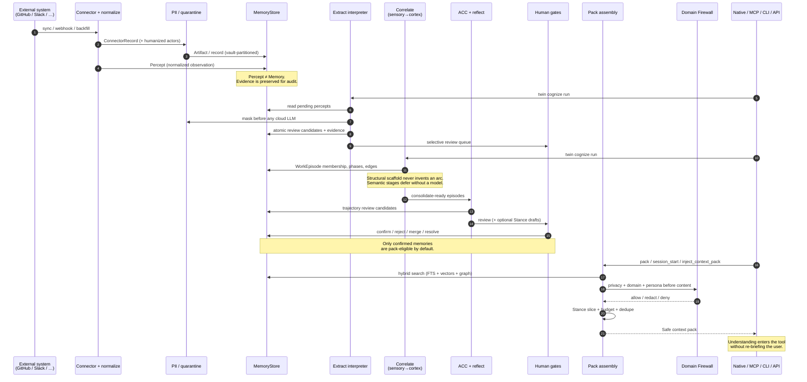
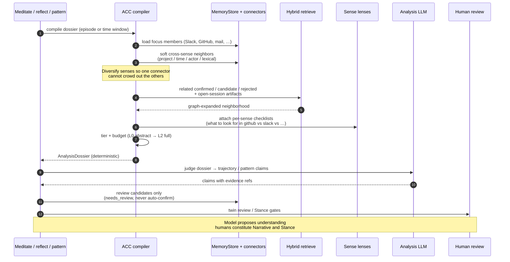

# Architecture

This document explains how Twin works — the three hard modules, contracts,
runtime topology, data model, privacy, review, observer and threat model.

Durable principles: [IDENTITY.md](IDENTITY.md#design-principles).
Cognitive concepts: [COGNITION.md](COGNITION.md) ·
[GLOSSARY.md](GLOSSARY.md). Cognize pipeline detail:
[COGNIZE.md](COGNIZE.md) · [v2.md](v2.md) §2. Epistemics:
[EPISTEMICS.md](EPISTEMICS.md). Academic inspirations (appendix):
[FOUNDATIONS.md](FOUNDATIONS.md). Product: [PRODUCT.md](PRODUCT.md).
Interfaces: [INTERFACES.md](INTERFACES.md). Cuts / tracker:
[ROADMAP.md](ROADMAP.md) · [v2-tracker.md](v2-tracker.md).

## Sense → Cognize → Inject

Public architecture is **three modules only**. Cognize’s internal stages
are pipeline detail ([COGNIZE.md](COGNIZE.md)) — not peer walls and not
README architecture.

```text
Sense → Cognize → Inject

  Sense   captures the world (deterministic I/O)
  Cognize forms and revises narratives (LLM brain — or hard halt)
  Inject  projects governed cognition to an authorized host
```



### Hard walls

| Module | Owns | Must not |
|---|---|---|
| **Sense** | Capture, normalize, allowlists, percepts, connector state (**deterministic I/O**) | Thinking: Reflections, Interpretations, meaning, commit Narrative, packs |
| **Cognize** | Entire **LLM-driven** pipeline (reflect / interpret / revise narratives / …); fade/remarkable *judgment* from the model | Speak to host UIs as Inject; own OAuth; any smart path without LLM; pretend the pipeline *is* the product architecture |
| **Inject** | Firewall (deterministic; lives in **privacy**) + pack render + **Observer slot** (LLM that watches the live conversation; reserved — today `twin.cognition.inject_observer`, flag `TWIN_INJECT_OBSERVER`, default no-op; target **`inject`**) + **stale-as-fresh refusal** | Mutate Cognize substrate as a side-effect; invent Narratives; heuristic “fake observe”; serve stale as current |

A host **conversation** is not a fourth module and not a product “mode.”
While it runs, Inject projects context outward and Sense absorbs residue
inward. Cognize never talks to Slack/Cursor directly.

**LLM-or-halt:** if the chat LLM is offline, unreachable, misconfigured, or
a heuristic meaning path is requested, Cognize refuses to run. Sense may
still capture; Inject’s Domain Firewall may still refuse unsafe leakage.
See [v2.md](v2.md) §0.

---

## Code packages (target layout)

Public architecture is still **only** Sense → Cognize → Inject. Repository
packages are being reorganized so code walls match those product walls —
this is unfinished v2 work, not optional cosmetics.

| Target package | Owns | Absorbs from today |
|---|---|---|
| **`sense`** | Capture, normalize, connector I/O, percepts | `twin.sense.connectors`, `twin.sense.sensory` (shims at old roots) |
| **`cognize`** | Narrative pipeline + services + Stance engine | `twin.cognize` + `twin.cognize.services` + `twin.cognize.stance_engine` |
| **`inject`** | Pack render, Observer slot, stale-as-fresh refusal | `twin.inject` |
| **`store`** | Persistence, search indexes, embeddings, migrations | `twin.store` (`MemoryStore` name transitional) |
| **`llm`** | Provider adapters and usage accounting | `twin.llm` |
| **`privacy`** | Domain Firewall, PII, disclosure guardrails | `twin.privacy` (+ Firewall / PII) |
| **`interfaces`** | CLI, MCP, REST, web, TUI Center, workers, export/backup | `twin.interfaces` (+ `runtime`, `sovereignty`) |

Transitional shims at old package roots have been removed; import the target
packages above. Dual-read `StoreClaim` rows and `judgment_*` table names may
remain in the store until data migration finishes — product copy must not call
them Memory or Judgment.

Inventory and cuts: [v2-tracker.md](v2-tracker.md) (v2.5 Package walls) ·
[ROADMAP.md](ROADMAP.md).

---

## Brain analogies

*(Engineering metaphors and the episode CLI stage map. Target Cognize
stages live in [COGNIZE.md](COGNIZE.md); do not expand the public diagram
above into Salience→…→Fade.)*

Twin does **not** simulate a biological brain. Neuroscience and cognitive science supply *engineering analogies*: they explain why the system separates episodic capture, semantic structure, executive control, salience and working context instead of collapsing everything into one retrieval index. Deeper academic sources live in [FOUNDATIONS.md](FOUNDATIONS.md).

### Cognitive systems mapped to Twin layers

| Cognitive system | Function | Abstraction in Twin |
|---|---|---|
| Episodic memory | events, meetings, conversations, temporal context | Percepts, Situations, Evidence, timeline |
| Semantic memory | facts, concepts, consolidated relationships | Narratives, entities, Relations, graph |
| Procedural memory | ways of doing, habits, workflows | procedures / playbooks (future) |
| Working memory | current task focus | query, Inject Observer slot, context pack |
| Executive control | selection, inhibition, evaluative posture | Domain Firewall, policies, Stance |

### Brain regions mapped to Twin components

| Brain concept | Purpose | Twin abstraction |
|---|---|---|
| Hippocampus | Episodic encoding & consolidation | Percepts + Situations + temporal validity |
| Cortex | Semantic consolidation | Narrative graph + Relations |
| Prefrontal cortex | Executive control | Stance + Domain Firewall |
| Basal ganglia | Action selection | Action policy (future) |
| Amygdala | Salience / risk | Sensitivity + review priority |
| Working memory | Current reasoning | Inject context pack |
| Global workspace | Conscious integration | Inject Observer (slot) |
| Long-term memory | Stable knowledge | Narratives + Evidence |
| Procedural memory | Habits | Procedures / workflows |

How that shows up in the pipeline:

```text
Artifact / connector feed
        ↓  (hippocampus-like encoding)
Percept
        ↓  (situation structure)
Situation / WorkEpisode arc — revisable, not a durable product noun
        ↓  (cortical consolidation + human review)
Interpretation → committed Narrative + Evidence + embeddings (indexes only)
        ↓  (prefrontal / amygdala-like gates)
Firewall + sensitivity + Stance
        ↓  (working context)
Safe context pack → Native / MCP / CLI / API
        ↕  (global workspace)
Inject Observer (parallel suggestions)
```

If a feature blurs these boundaries — e.g. treating raw text as a committed
Narrative, or bypassing the firewall “for convenience” — it fights the
architecture, not just a style preference.

### Brain analogies and CLI stages (episode pipeline)

Episode cognition turns connector records into trajectory structure as a
chain of stages named for brain regions. The happy path is Cognize
([COGNIZE.md](COGNIZE.md)); `twin episode reflect` remains for trajectory
candidates from a built arc. The `sensory` scaffold and `hippocampus_bind`
are structural (explicit anchors, exact identity/project, membership);
`basal` is report-only lifecycle. Stages that *interpret* (`amygdala`,
`cortex` edges/phases, `hippocampus_consolidate` reflect) use an LLM (or a
deterministic test override) and **halt / defer** when the model is missing
— they never invent an arc from lexical rules. `extractor=heuristic` blocks
those semantic stages. `twin cognize run` drives the pipeline through human
gates (`twin review`, `twin stance approve`).

| # | Stage id (`brain_stage`) | Brain region | Job | Writes | CLI |
|---|---|---|---|---|---|
| 0 | `sensory` | encoding substrate | vault / dirty / ID anchors | partitions, membership | `twin cognize run` |
| 1 | `amygdala` | Amygdala (salience) | classify member role + salience | phase roles (`proposed`) | `twin cognize run` |
| 2 | `basal` | Basal ganglia | read episode lifecycle | lifecycle (report-only) | `twin cognize run` |
| 3 | `hippocampus_bind` | Hippocampus (binding) | membership consolidation | links | `twin cognize run` |
| 4 | `cortex` | Cortex (semantic) | understand arc: phases + edges | phases/edges (`method=llm`) | `twin cognize run` |
| 5 | `hippocampus_consolidate` | Hippocampus (consolidation) | reflect trajectory | review candidates (StoreClaim) | `twin episode reflect` |
| 6 | `prefrontal` | Prefrontal cortex | draft Stance | pending Stance proposal | `twin stance propose-episode` |

Human inhibition gates sit between consolidation and executive control: `twin review` (confirm candidates) precedes `prefrontal`, and `twin stance approve` is the executive gate for durable Stance. The Global Workspace (Memory Observer) runs in parallel and is **not** a stage in this chain.

## Runtime sequences

These sequence diagrams show how Twin turns distributed work into reusable
understanding — and how that understanding re-enters authorized tools.
They are contracts of intent, not an inventory of every module.

### From Connector to Context Pack

End-to-end path from an external system to a pack an authorized client can
consume. Extraction creates **atomic** candidates; meditation builds
**situations** (`WorkEpisode`) and may reflect **trajectory** candidates;
packs only use what privacy and review allow.



### Native Session — Inject & Absorb

Native binding is how a host gets continuity **into** a chat and returns what happened **out** as evidence — without a parallel memory store and without auto-confirming Memory or Judgment.

```mermaid
sequenceDiagram
    autonumber
    participant Host as Host (Claude Code)
    participant Native as twin native event
    participant Bind as HostSessionBinding
    participant Sess as CognitiveSession
    participant Vote as Domain search-vote
    participant Pack as Pack assembly + Firewall
    participant Runtime as twin-runtime
    participant Store as MemoryStore
    participant ExtLLM as Extract

    Host->>Native: SessionStart (hook)
    Native->>Bind: open / resume binding
    Native->>Sess: start CognitiveSession
    alt domain already known
        Native->>Pack: assemble pack (hot-path deadline)
        Pack->>Store: retrieve + govern
        Pack-->>Native: context pack
        Native-->>Host: additionalContext (inject)
    else unclassified (no prompt text yet)
        Native-->>Host: bind only (empty pack)
    end

    Host->>Native: UserPromptSubmit
    Native->>Sess: observe user_message
    alt search-vote names a domain
        Native->>Vote: upgrade domain once
        Native->>Pack: emit pack
        Pack-->>Host: additionalContext (inject)
    else still inconclusive
        Native->>Runtime: enqueue session_domain_resolve
        Native-->>Host: return fast (no mid-turn push)
        Runtime->>Vote: background multi-message classify
        Runtime->>Bind: freeze domain + pending_context_pack
        Note over Host,Bind: Next injection-capable turn<br/>emits the deferred pack
    end

    Host->>Native: PostToolUse / Stop (turn_completed)
    Native->>Sess: observe tools + turn<br/>(Stop does not close binding)

    Host->>Native: SessionEnd
    Native->>Bind: close binding immediately
    Native->>Runtime: enqueue session_complete
    Native-->>Host: ok (fail-open if configured)
    Runtime->>Sess: fold dialogue + deliberate notes
    Runtime->>Store: session_summary Percept
    Runtime->>ExtLLM: cognize → review candidates
    ExtLLM->>Store: candidates for human review
    Note over Host,Store: Inject governed understanding at the start;<br/>absorb the session as evidence at the end.<br/>Humans still confirm durable Narrative / Stance.
```

Reference: Claude Code hooks


### Analysis Context Compiler (ACC)

Reflect and pattern passes must **judge**, not discover the corpus. The ACC
is a deterministic compiler: it builds a budgeted, cross-sense
`AnalysisDossier` (primary evidence, soft neighbors, related memories,
per-sense lenses) and only then calls the analysis LLM. No LLM runs inside
the compile itself.



## Architecture Principles


These principles are the constitution of `twin`. Roadmaps can change, backends can change and interfaces can change, but new features should remain compatible with these rules. When an implementation choice is ambiguous, the preferred option is the one that preserves cognition, autonomy, evidence, safety and portability.

### Twin is a cognitive infrastructure

`twin` is not a memory database. It is an attempt to externalize part of a person's cognition without externalizing their autonomy.

That first principle changes the meaning of every technical decision in the project. The system is not valuable because it stores many facts; it is valuable if it helps the user continue thinking with less friction, fewer repeated explanations and stronger continuity across tools. The database, graph, embeddings, API and MCP server are implementation details in service of that larger goal.

Autonomy is the boundary. `twin` may remember, organize, retrieve, suggest and explain, but it must not quietly take ownership of the user's values or decisions. The project succeeds when it gives external tools access to a safer cognitive substrate while keeping the user in control of durable Narrative, Stance and action.

### Knowledge is not understanding

A million perfectly indexed facts do not produce good decisions. Knowledge answers what is known; understanding emerges from the interaction between Narratives, context, temporal state, constraints, relationships, consequences and Stance.

`twin` therefore stores structured accounts, but optimizes for understanding. A useful context pack should not merely say "this fact matched the query". It should help an LLM understand why the account matters now, whether it is still fresh, which project or persona it belongs to, what evidence supports it and how Stance should affect the next decision.

This is the difference between a retrieval layer and a cognitive layer. Retrieval can return information; understanding requires organizing information so that future reasoning improves.

### Durable accounts are compression

The system should never try to store reality itself. The brain does not preserve every signal; it compresses experience into patterns, episodes, concepts, salience and decision-relevant traces. `twin` should do the same.

A Narrative is worth committing when it can change future action: a decision, constraint, preference, rejected alternative, relationship, risk, commitment, lesson or contextual fact that will matter later. Raw artifacts can be stored or referenced when useful, but durable substrate should be a compressed representation of what the system may need in order to reason better in the future.

This principle changes the ingestion pipeline. The goal is not maximum capture. The goal is selective consolidation: preserve what has future cognitive value, keep evidence links for auditability and avoid turning the user's life into an indiscriminate archive.

### Artifact ≠ Percept ≠ Narrative ≠ Stance

The backbone of the project is a pipeline from reality to action:

```text
Reality
    ↓
Artifact
(file, transcript, message, note, issue, commit)
    ↓
Percept
(normalized observation)
    ↓
Situation
(working cluster — revisable structure, not the durable product)
    ↓
Interpretation → Narrative
(competing explanation → human-committed account with evidence)
    ↓
Stance
(how future similar cases should be evaluated)
    ↓
Inject / Action
(suggestion, draft, reminder, automation or silence)
```

An artifact is a source object. A percept is what the system notices from that artifact. Situate proposes revisable situation structure without committing a Narrative. An Interpretation is a competing explanation; a Narrative is the durable account after human commit. Stance is evaluative posture — not another factual account. Action is downstream from all of them and must not be confused with Narrative.

Keeping these categories separate prevents the system from treating raw text as truth or treating temporary interpretation as stable belief. If a feature stores everything it sees as a committed Narrative, it is probably wrong. If it jumps directly from a percept to action without evidence, firewall and Stance, it is unsafe.

### The graph is truth; embeddings are indexes

Embeddings answer similarity. They do not answer truth. They cannot explain why a Narrative exists, when it was true, which source supports it, whether it supersedes another account or whether it is allowed in the current domain. They are indexes, not substrate.

The canonical substrate of `twin` is the temporal graph: Narratives, entities, Relations, Evidence, domains, validity windows, EpistemicState and status. Embeddings can make this graph easier to search, but the graph remains the authoritative representation of what the system knows.

This is both a technical and philosophical decision. The user must be able to delete every embedding, regenerate indexes with a different model and still preserve the cognitive substrate. Similarity is useful; truth requires structure, evidence and time.

### Evidence before Narrative

Every durable Narrative must point back to evidence. Evidence can be a source document, transcript segment, commit, issue, note, calendar event, message or explicit user confirmation. Without evidence, the system may hold an Interpretation, but it should not promote it to a committed Narrative.

Evidence is what makes the system inspectable. It lets the user correct bad extraction, distinguish fact from interpretation and understand why a future LLM received a particular context pack. It also gives implementers a defense against silent hallucinated accounts.

This principle does not mean all evidence must be exposed to every tool. Evidence has its own sensitivity and domain. But the link must exist inside the local system so the user can audit, export, revise or delete it.

### Narratives evolve

`twin` is an evolving cognitive model, not a static database. It is expected to change continuously as projects, preferences, constraints, relationships and beliefs change. Static accounts are a bug when they pretend old context is still current.

Narratives carry EpistemicState (fresh / stale / superseded / tombstoned) and may be revised, branched or superseded without deleting history. The system should preserve what used to be true while making clear what is true now.

This protects the user from stale personalization. A tool that remembers the user well today but keeps applying years-old preferences without context is not intelligent; it is outdated with confidence.

### Sessions are units of cognition

A session is where context, intention, evidence and interpretation meet. It may be a conversation, work block, meeting, debugging run or planning episode. `twin` should treat sessions as the primary unit for observing cognitive change.

This prevents the system from overreacting to isolated sentences. A single utterance may be exploratory, emotional or provisional. A session gives enough surrounding context to understand whether something was a decision, a rejected option, a preference, a temporary constraint or just brainstorming.

Session-based change also improves auditability. Instead of asking "why does the system believe this?", the user can inspect which session produced the candidate Interpretation or Stance draft, what evidence was present and whether the conclusion still holds.

### Firewall before reasoning

Privacy and domain separation must happen before reasoning, not after. The main LLM should receive only the accounts that are allowed for the current target domain, persona, sensitivity level and task.

Features that bypass the firewall for convenience are architectural regressions. The right flow is retrieval, classification, filtering, logging and then context packing. The LLM reasons over the safe pack, not over the raw substrate universe.

### Stance evolves independently

Narrative describes what happened, what was decided, what exists and what evidence supports it. Stance describes how the user tends to decide, prioritize, reject, approve or communicate. They are related, but they should not be collapsed into the same mechanism.

A new Narrative can be committed without changing Stance. Conversely, Stance can evolve after many sessions reveal a stable pattern. The evolution paths are different, and Stance changes should usually require stronger evidence, aggregation across sessions or explicit human approval.

This independence makes the system safer and more explainable. Narratives can be frequent; Stance should be conservative because it changes how future tools act on behalf of the user.

This is one of the project's hard safety boundaries. Once sensitive context enters a model prompt, the leak has already happened. Even if the model behaves well, the system has lost the ability to prove that forbidden content was not considered. A firewall is therefore not a formatting layer; it is an access-control layer.

### Native integration where possible, MCP everywhere

`twin` should integrate directly into a host application's UI when the host provides supported APIs, hooks or protocols. Native integration offers the best experience because it can surface Narratives and context within the tool the user is already using.

When native integration is not available, MCP remains the universal and interoperable interface for safely requesting Narratives, packs and Stance. The two modes share the same cognitive core and data; native integration must not create a proprietary silo.

This keeps the project aligned with its role as infrastructure. The goal is not to replace ChatGPT, Claude, Cursor or future interfaces, but to improve them through native integration where possible and MCP everywhere else.

### Exportability over lock-in

The user must be able to leave. Exportability is not a nice-to-have; it is a moral and architectural requirement for a system that stores personal cognition. Narratives, Evidence, entities, Relations, policies, Stance profiles and index metadata should be representable in formats that can be inspected and migrated.

This protects the user from the project itself. If `twin` succeeds, it may become deeply integrated into the user's thinking and work. That makes lock-in especially dangerous. The more important the system becomes, the easier it must be to audit and exit.

Implementers should prefer boring, documented and portable representations over clever storage tricks that only one runtime understands. Performance optimizations are welcome when they do not compromise export.

### Progressive cognition

The system should never jump directly from observation to autonomy. Each cognitive layer must become reliable before the next one exists:

```text
observe
  ↓
form accounts
  ↓
understand
  ↓
take Stance
  ↓
suggest
  ↓
act
```

This principle defines the roadmap more clearly than a feature list. A reliable importer, Narrative schema, firewall, context pack and MCP tool are more valuable than an impressive but unsafe agent loop. The system should first form accurate accounts, filter safely and explain itself clearly.

Progressive cognition does not reduce the vision; it makes the vision survivable. Each version should create practical value while preserving the path toward deeper cognition and safer action.

### Local-first by default

The default assumption is that personal Narratives, Stance, Evidence and indexes live locally under user control. Cloud services may be useful for specific extraction, backup or collaboration flows, but they should not become mandatory for the core system to function.

Local-first is not nostalgia; it is a safety and agency requirement. The data in `twin` can contain private life context, third-party information, work constraints, health hints, relationship details and decision patterns. The user must be able to inspect it, back it up, delete it, move it and run the core system without asking a vendor for permission.

This principle also improves longevity. A personal cognitive OS should outlive model providers, SaaS pricing changes and product shutdowns. Local data plus open export paths are what make that possible.

### Human approval for durable Stance

Stance changes affect future behavior. They can change what the system recommends, blocks, prioritizes, summarizes or exposes. For that reason, durable changes to Stance should require explicit human approval or a conservative review workflow.

The system may propose Stance updates. It may notice repeated patterns, contradictions or stable preferences. But proposing is different from deciding. A user saying "this project is messy" during a frustrating session should not automatically become a durable belief that the user hates complexity everywhere.

This principle preserves agency. `twin` can learn with the user, but it should not silently rewrite the user's values, boundaries or decision model.

### Narratives exist to improve future action

Narrative is not archival for its own sake. `twin` keeps accounts because future thinking, decisions and actions can become better when the right context is available at the right moment.

Action does not need to mean autonomous execution. It can mean a better answer, a safer refusal, a more relevant suggestion, a draft, a reminder, a question for clarification or silence. The point is that durable substrate should eventually reduce cognitive latency: the time between a thought and the information required to continue that thought.

Reducing cognitive latency is one of `twin`'s primary goals. The system should make relevant context feel close to thought without sacrificing evidence, privacy or user control.

## Practical philosophy

Preferences that should win when choices conflict:

```text
local-first > cloud-first
cognitive interpretation > lexical classification
deferred understanding > simulated understanding
structured Narrative > raw text
explicit Stance > implicit imitation
temporal graph > infinite markdown
vectors as index > vectors as truth
MCP > mandatory own UI
deterministic governance > policy delegated to the LLM
firewall before the LLM > trusting the LLM
selective review > total manual curation
mandatory evidence > sourceless account
exportability > lock-in
```

Continue in [PRODUCT.md](PRODUCT.md) for domain rules · [ROADMAP.md](ROADMAP.md) and [CHANGELOG.md](CHANGELOG.md) for versions · [INTERFACES.md](INTERFACES.md) ([Native](NATIVE.md) / [MCP](MCP.md) / [CLI](CLI.md) / [REST](REST.md)) · [FOUNDATIONS.md](FOUNDATIONS.md) for academic roots.

## Stack and technical decisions

### Local-first

Everything lives in `~/.twin` or `$TWIN_HOME`:

- SQLite;
- policies YAML;
- Stance YAML bootstrap (`judgment.yaml` filename until package migration);
- exportable data;
- simple backups.

Backup = copy the folder.

Full export = `twin export`.

### Storage behind the store facade

Canonical substrate lives behind a single store interface (today
`MemoryStore` in `twin/memory/`; target package **`store`**).
**PostgreSQL + pgvector** is the primary backend (server-side vector
search, tsvector/GIN for full-text, JSONB). **SQLite** remains the
zero-config backend for local/dev use. The logical model includes
sources, Narratives (and dual-read rows during migration), Evidence,
entities, Relations, embeddings, firewall logs and full-text indexes —
regardless of backend.

Alternative graph stores (Neo4j, FalkorDB, Graphiti, …) may replace the
engine later, but the canonical substrate must remain exportable.

### Vectors as index, not as substrate

Embeddings are useful for semantic search, but they are not the true substrate.

Project rule:

```text
graph + Narratives + Evidence = canonical substrate
vectors = regenerable index
LLM = extractor/interpreter (Cognize)
MCP / Native = interface
```

This avoids lock-in and allows reindexing in the future.

### Hybrid search

Search combines:

- FTS5/BM25;
- embeddings;
- entity boost;
- firewall filtering.

Search must answer not only "what looks semantically similar?", but "what is relevant, allowed and trustworthy for this context?".

### Native where possible, MCP everywhere

The project must not depend on its own UI. Prefer **native** when a client can bind session lifecycle to Twin. **MCP** remains the universal tool surface for every MCP host — and complements native mid-task. CLI and local API expose the same cognitive core. Full reference in [INTERFACES.md](INTERFACES.md#clients) · [NATIVE.md](NATIVE.md) · [MCP.md](MCP.md).

## Data model

Product units are **Narrative**, **Stance**, **Evidence**, **Relation**,
**Situation**, **Reflection**, **Interpretation** ([GLOSSARY.md](GLOSSARY.md) ·
[COGNIZE.md](COGNIZE.md)). The `StoreClaim` shape below is the **dual-read /
legacy row** still served by today’s store during migration — not the product
noun.

### StoreClaim (dual-read row)

A store claim row must contain:

```json
{
  "id": "clm_...",
  "type": "event | fact | decision | preference | belief | task | procedure | relationship | communication_act | constraint",
  "title": "...",
  "summary": "...",
  "domain": "work | technical | personal_preferences | assistant_preferences | relationship | family | health | finance | legal | emotional | general",
  "persona": "developer | individual | partner | son | friend | manager | assistant-user",
  "sensitivity": "public | internal | private | restricted",
  "confidence": 0.0,
  "status": "candidate | confirmed | rejected | deprecated | contradicted",
  "valid_from": "YYYY-MM-DD",
  "valid_until": null,
  "payload": {},
  "needs_review": true,
  "review_reason": "...",
  "source_ids": ["src_..."],
  "entities": ["Atlas", "FastAPI", "Postgres"]
}
```

### Memory types

| Type | Meaning |
|---|---|
| `event` | something that happened |
| `fact` | relatively objective fact |
| `decision` | decision made, with rationale and consequence |
| `preference` | stable or semi-stable preference |
| `belief` | belief/opinion that may change |
| `task` | task, commitment or promise |
| `procedure` | way of doing something |
| `relationship` | relationship between people/contexts |
| `communication_act` | communicative act: request, promise, refusal, apology, decision |
| `constraint` | rule, limit or prohibition |

### Mandatory evidence

Every memory must carry evidence, preferably a verbatim excerpt from the source.

Without evidence, a claim is suspect.

This reduces hallucinated accounts and enables human review.

### Temporality

Narratives and claims must have temporal validity.

Example:

```text
year N:   works at Acme Corp
year N+1: works at Globex
```

Both can be true, but not simultaneously.

Temporal contracts already in the model:

- `supersedes` / `contradicts` relations (human-gated lifecycle ops);
- `valid_from` / `valid_until` windows on memories;
- status transitions (`deprecated`, `stale`, `unsupported`, …).

Still open: richer automatic validity inference and a full belief timeline.

## Ingestion and extraction pipeline

End-to-end runtime (connectors → Cognize → pack) is in
[Runtime sequences](#runtime-sequences). The short ingest spine:

```text
raw source
        ↓
normalization
        ↓
PII filter
        ↓
interpret (chat LLM) or defer — never silent lexical “understanding”
        ↓
schema normalization
        ↓
dedupe
        ↓
review classification
        ↓
graph + evidence + embedding
```


Professional / technical sources (connectors and file ingest):

- GitHub, Slack, Gmail, Outlook, calendar;
- Fireflies / Meetily-style meetings;
- local folders, markdown, transcripts and technical documents.

Explicitly out of product scope for intimate or continuous capture (see
[PRODUCT.md](PRODUCT.md)):

- personal WhatsApp and social networks;
- continuous screen / voice capture;
- wearables and home robotics as default sensors.

## PII and privacy

The project assumes that leaking personal data can cause real harm.

Before any cloud LLM, text must go through PII masking.

PII classes the local filter handles:

- emails;
- phone numbers;
- CPF / CNPJ / RG / CEP;
- street addresses (Rua/Av./…);
- cards, IBAN, PIX keys;
- IPs;
- API keys (OpenAI-style, GitHub/GitLab PATs, Slack, AWS, Google);
- JWTs and bearer tokens;
- passwords and secret assignments;
- private keys.

Before real personal sources, expand to:

- sensitive proper names;
- family member names;
- partner names;
- addresses;
- banking data;
- medical data;
- private URLs;
- internal company identifiers;
- private Jira/GitHub links;
- customer names;
- third-party data.

Rule: sensitive data must be blocked, masked, hashed or kept local.

## Selective review

The user must not review everything manually. Review should happen by exception.

A memory goes to review when:

- confidence < threshold;
- sensitivity is `private` or `restricted`;
- domain is outside the active product boundary;
- type is judgment-adjacent (`belief`, `procedure`);
- the memory seems to update/contradict another;
- there is partial duplication;
- the memory has high impact;
- the source has low trustworthiness;
- the memory may affect future behavior.

States:

```text
candidate → confirmed | rejected | merged | split | archived
confirmed → deprecated | contradicted | superseded | stale | unsupported | archived
```

Review answers richer questions than binary approve/reject: is it new, a
paraphrase, more specific, more current, contradictory, mergeable, splittable?
Suggested actions include confirm, reject, edit, merge, split, supersede,
contradict, defer, archive and request_more_evidence.

## Evolving judgment model

Narratives say **what happened**.

Stances say **how the user thinks** — preferences, beliefs, principles, values, heuristics and hard constraints.

YAML under `~/.twin/judgment.yaml` remains bootstrap and export. The operational source of truth is the judgment store (SQLite/PostgreSQL): immutable revisions, versioned composition, proposals and snapshots.

Bootstrap example (still valid as seed):

```yaml
principles:
  - privacy > convenience for personal data
  - maintainability > beautiful architecture in personal projects
  - never mix intimate context with work
  - prefer direct clarity over empty politeness

technical_preferences:
  - avoid overengineering
  - prefer a simple stack until complexity is justified
  - evaluate lock-in before adopting a tool
  - canonical data in an open, exportable format

decision_criteria:
  - compare maintenance cost before performance
  - evaluate decision reversibility
  - measure real usefulness before expanding scope

communication_style:
  language: pt-BR by default
  tone: direct, technical, no basic tips
```

Durable changes require human approval. Twin may observe and propose; only the user constitutes. Constitutional items need an extra confirmation flag. Heuristic conflict detection never deactivates active judgment on its own.

Context packs receive an **applicable** judgment section (scoped by domain, persona, project, audience, client, stage and conditions), not the full profile. Sessions that consumed judgment mark extracted memories as `judgment_influenced` so Twin cannot quietly self-confirm its own recommendations.

## Memory Observer

The Memory Observer is a parallel AI/module that follows the current text and suggests related memories.

It does not answer for the user. It must not act. It only remembers.

Flow:

```text
current text / task / draft
        ↓
candidate memory search (hybrid, vault-wide)
        ↓
firewall (consumer domain: the open session, or an explicit argument)
        ↓
ranking (semantic + text + entity, plus a soft same-domain boost)
        ↓
compact suggestion for the main AI
```

The consumer domain is never guessed from the text: it is the frozen domain of the open session or an explicit argument. With no such domain the firewall target is `unclassified` and the suggestion comes back empty — ambiguity yields *less* context, never another domain's memories.

Opening a session scope on the request path (`resolve_context_domain`) is a retrieval vote across confirmed memories only — no local LLM in the hot path. When the vote is inconclusive the session stays `unclassified` until a background `session_domain_resolve` job (multi-message evidence) or an explicit client/MCP domain freezes it. Native hosts: Claude's **Stop** is end-of-turn (observe only); **SessionEnd** closes the binding and enqueues background `session_complete` for the `session_summary` Percept (see [NATIVE.md](NATIVE.md); requires `twin-runtime`).

This is inspired by Global Workspace Theory: many modules operate in parallel, but only some information enters the global workspace.

Desired format:

```json
{
  "inferred_domain": "technical",
  "suggested_context": [
    {
      "claim_id": "mem_...",
      "summary": "...",
      "why_relevant": "semantic similarity + entity match",
      "confidence": 0.87,
      "allowed": true
    }
  ],
  "blocked_context": [
    {
      "claim_id": "mem_...",
      "reason": "relationship_not_allowed_outside_own_domain"
    }
  ]
}
```

## Risks

### Privacy

Maximum risk. The system may contain intimate and professional information. Mitigations:

- local-first;
- PII masking;
- firewall;
- logs;
- review;
- default-deny in sensitive domains;
- export/delete;
- future encryption.

### Memory hallucination

LLMs can extract false memories. Mitigations:

- mandatory evidence;
- confidence;
- candidate status;
- selective review;
- blocking candidates in critical contexts;
- internal citations.

### Domain mixing

The most dangerous operational risk. Mitigations:

- mandatory domain/persona/sensitivity;
- firewall before the LLM;
- block logs;
- explicit target_domain;
- tested policies.

### Overengineering

The risk of trying to build the whole brain before the substrate can
govern it. Mitigation:

- keep the product boundary on technical / professional work first;
- keep intimate domains out of default ingestion;
- do not build a chat of its own;
- prefer Native / MCP over a parallel product surface;
- measure real usefulness.

### Vendor dependency

Mitigation:

- canonical data in an open format;
- regenerable embeddings;
- replaceable LLM;
- SQLite/JSON export;
- MCP as the interface.

---


## Threat model

Local-first personal cognitive OS. Assets: memories, judgment, connector secrets, session context, backups.

## Trust boundaries

| Boundary | Trust |
|---|---|
| User / local host | Trusted operator |
| Twin process + `$TWIN_HOME` store | Trusted computing base |
| Cognitive model / LLM | Untrusted for authority — may hallucinate; never auto-confirms Memory/Judgment |
| MCP / HTTP / CLI clients | Authenticated principals with least privilege; default deny |
| External connectors (Slack, GitHub, mail, …) | Untrusted content sources; evidence only |
| Backups / exports | Sensitive at rest; treat as equivalent to the live store |

## Top threats and controls

1. **Prompt injection via ingested content**  
   Content is data, never instruction. Screening (`detect_injection`), quarantine, pack-time exclusion. Connectors quarantine malicious records before percepts.

2. **Cross-domain / persona privilege amplification**  
   Domain firewall + persona scope intersection (never amplifies). Cross-domain recall blocked by default.

3. **Connector credential theft / over-privilege**  
   Secrets in encrypted credential store (`credential_ref` only in DB). Least-privilege health warnings. Revoke is resumable and honest about residual secrets.

4. **Silent corruption of confirmed cognition**  
   Confirm requires evidence + human actor. Consolidation and session closure never auto-confirm Narratives/Stances. Revision collisions go to DLQ, never overwrite.

5. **Runtime poison / stuck workers**  
   CAS claim, leases, DLQ for permanent errors; `model_unavailable` stays retryable (never DLQ). Vault isolation on claim.

6. **Exfiltration via tool output / context packs**  
   Blocked items report counts/reasons, not forbidden content. Injection-screened packs. Capability-gated MCP surfaces.

7. **Incomplete deletion / backup leakage**  
   Tombstones + source deletion events. Backup/export are full-fidelity — operators must protect backup media. Encrypted/incremental backup hardening remains follow-on work.

8. **Malicious or buggy MCP client**  
   Capability checks; preview/confirm fingerprints on agent-facing mutating connector ops; fail closed on missing principal/scope.


## Residual risk

Operators still must: protect `$TWIN_HOME` and backup directories, rotate connector tokens, and treat every external document as adversarial input.

Connect via [INTERFACES.md](INTERFACES.md). Install in [SETUP.md](SETUP.md). Operate in [OPERATIONS.md](OPERATIONS.md). Product in [PRODUCT.md](PRODUCT.md). Roadmap in [ROADMAP.md](ROADMAP.md). Changelog in [CHANGELOG.md](CHANGELOG.md).
