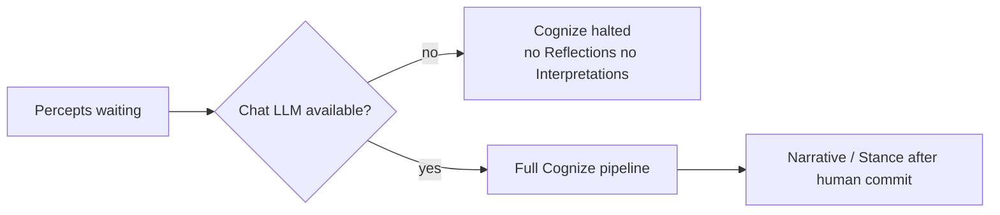
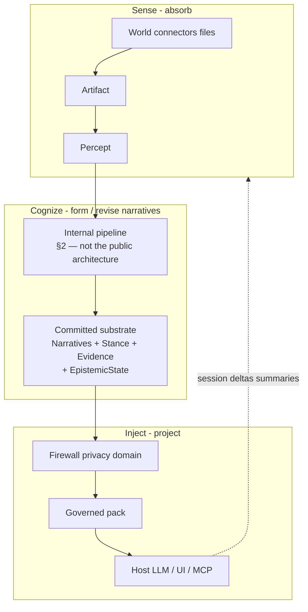
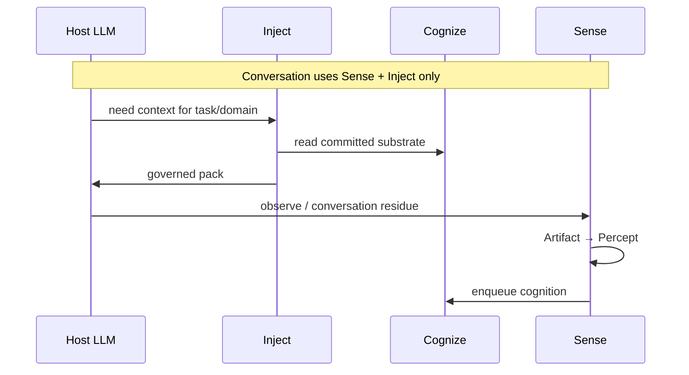
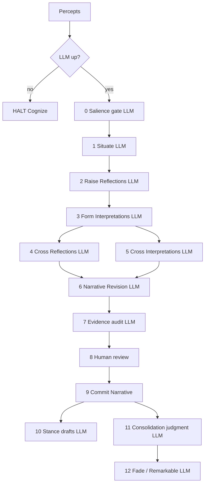
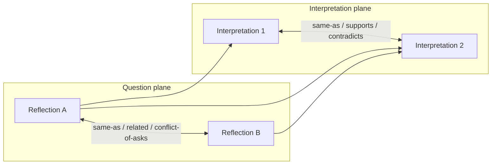
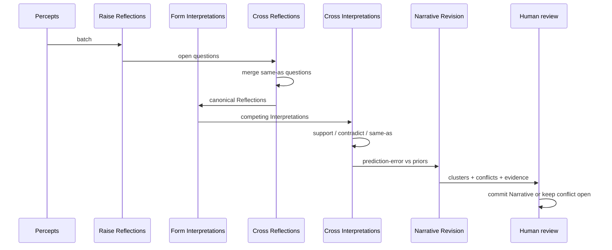
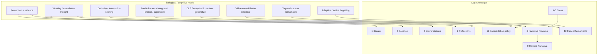
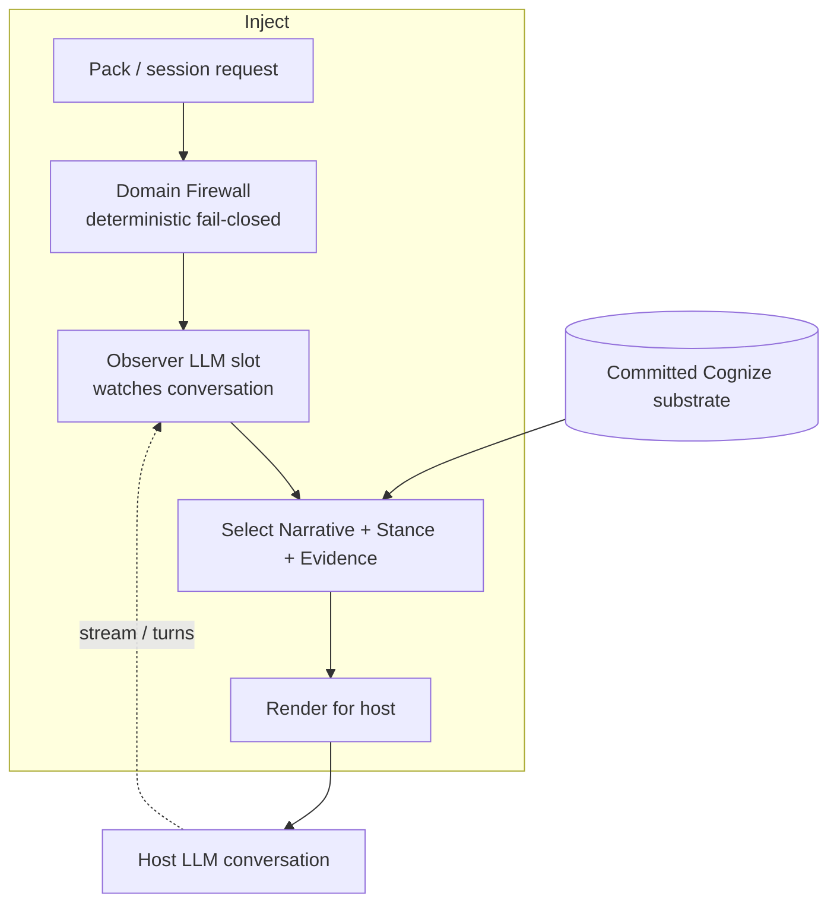
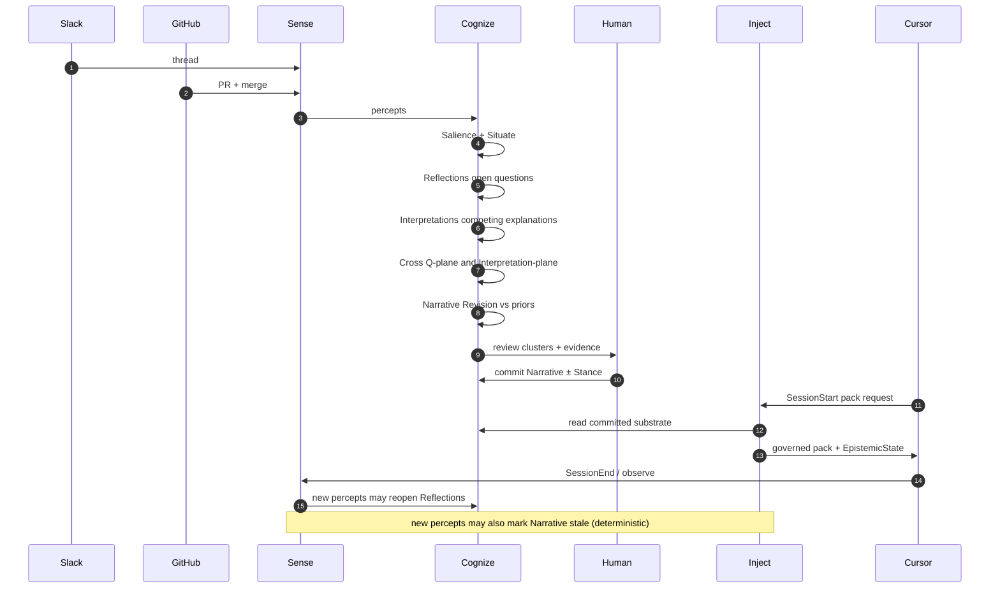

# Twin — redesign v2: longitudinal narratives, architecture vs pipeline, CLI command center

**Durable homes (prefer these over this journal):**
[ARCHITECTURE.md](ARCHITECTURE.md) · [COGNIZE.md](COGNIZE.md) ·
[EPISTEMICS.md](EPISTEMICS.md) · [RESEARCH.md](RESEARCH.md) ·
[COMMAND_CENTER.md](COMMAND_CENTER.md) · [v2-tracker.md](v2-tracker.md).

In-repo working document: [`docs/v2.md`](./v2.md). Prior drafts lived as `~/twin-cognition-redesign.md`.

- Cognize was oversimplified → expand into implementable stages (this is the **next product phase**, not a sketch).
- Session is **not** a fourth hard wall and **not** a product “mode” — during a host conversation, **Sense** captures what leaves the session; **Inject** projects context when relevant. That is all (§1).
- Correlation of Reflections / Interpretations needs an explicit mechanism with academic grounding.
- Reddit thread (r/AI_Agents, Aug 2026) is folded into **§9** — epistemic state, stale rejection, ACL inheritance, source independence, drift vs reversal.
- donk8r follow-up (correlated evidence → information, not just independence) confidence ≠ agreement accumulation; silent reversal → low-confidence challenger + cross-source reinforcement; Sense coverage prerequisite; Event vs Situation left open.
- ARCTIC / arXiv 2607.29516 folded as **§5.1** — intent / backtranslation / spotlight as *adjacent* Sense+Inject motifs; agentic intent-drift ≠ Twin epistemic drift.
— identity vs GBrain; Architecture ≠ Cognize pipeline; **Interpretation** (ex-Proposal); **Narrative** (durable product); **Narrative Revision** (ex-Integrate-or-Separate); Understanding as *emergent*, not a table.
— session wording; Narrative composition (not literary L1–L4 schema); stale **before** Cognize; confidence **read-time** + `same_originating_decision` + retain dissent (donk8r); open decisions settled (§10).
— Twin CLI as **command center** (§12); cognition verbs retarget to v2 pipeline (`cognize` / `narrative` / `stance`; deprecate `extract`/`meditate`/`correlate` as primary UX).

Companion LLM inventory (if present): `~/twin-llm-upstream-flows.md`.  
In-repo lineage: `docs/FOUNDATIONS.md`, `docs/COGNITION.md`, `docs/GLOSSARY.md`.

**Status of academic claims:** design *inspiration* and normative criteria — same stance as Foundations (not “Twin implements a hippocampus”). Academic depth belongs in this redesign / eventual `RESEARCH.md`; **not** in the public README.

---

## 0−. Identity (Twin is not a universal cognition OS)

### What Twin is

> **A longitudinal cognitive architecture for forming, revising, and carrying governed narratives across sources, models, and interfaces.**

In short: turn continuously observed life into **persistent, revisable, governed narratives** that any authorized intelligence can inherit — with open reflections, competing interpretations, epistemic state, and human authority over durability.

The product unit is not “an answer to a query.” It is the **history of an interpretation of the world**:

```text
what we believed
  → what evidence arrived
  → what no longer explains observations
  → which new interpretation appeared
  → what was revised
  → which Narrative represents the current account
```

### Twin vs GBrain (and similar “brain layers”)

Overlap is real and must be acknowledged: continuous ingest, graphs, synthesis, citations, gap detection, consolidation, MCP, ACL, background jobs. **Those alone are no longer differentiators.**

| | **GBrain-like knowledge layer** | **Twin** |
|---|---|---|
| Canonical cycle | Sources → index/KG → retrieve → **query-time synthesis** → cited answer (+ gaps) | Percepts → situations → open reflections → competing **interpretations** → **narrative revision** → evidence audit → human commit → persistent **Narrative** + Stance + EpistemicState → **proactive governed Inject** |
| Primary experience | “Ask the brain; get a synthesized, cited answer.” | “Before anyone asks, keep a revisable account of what is happening, why, what changed, and what stance may apply.” |
| Persistent unit | Pages / knowledge usable by agents | **Narratives** (plus open Reflections, Relations, Stances) |
| Continuity | Maintain and answer from a KB | Carry **longitudinal** revision of understanding across sessions and hosts |
| Stance | Usually folded into the answer | Separated: what happened vs how similar cases should be evaluated |

**Not Twin’s ambition:** model all cognition and all agency. **Is Twin’s ambition:** form and project *governed narratives* over time. Scope risk is high but coherent if identity stays on that spine.

### Architecture vs pipeline (settled documentation rule)

Do not let Cognize’s internal stages inflate the public architecture story.

```text
ARCHITECTURE (simple — README / ARCHITECTURE.md)
────────────────────────────────────────────────
Sense → Cognize → Inject

  Sense   captures the world (deterministic I/O)
  Cognize forms and revises narratives (LLM brain)
  Inject  projects governed cognition to an authorized host
```

```text
COGNIZE PIPELINE (detailed — COGNIZE.md / this §2)
───────────────────────────────────────────────────
Salience → Situate → Raise Reflections → Form Interpretations
  → Cross Reflections → Cross Interpretations → Narrative Revision
  → Evidence Audit → Human Review → Commit Narrative
  → Stance drafts → Consolidate → Fade / Remarkable
```

Planned doc split when this lands in-repo:

| Doc | Owns |
|---|---|
| `ARCHITECTURE.md` | Sense / Cognize / Inject walls, contracts, runtime topology |
| `COGNIZE.md` | Staged pipeline, entities, I/O contracts, Narrative Revision |
| `EPISTEMICS.md` | Provenance, freshness, independence, contradictions, ACL, tombstones |
| `RESEARCH.md` | Academic foundations, hypothesis mapping, experiments, bibliography |

This redesign may keep all four concerns in one file for now; **README must stay on the architecture layer only.**

---

## 0. Non-negotiable: LLM is the core (no offline cognition)

**Cognition without an upstream chat LLM does not exist in this redesign.**

| Forbidden in Cognize | Required |
|---|---|
| Heuristic extractors | Live chat LLM for every cognitive stage |
| Echo / mock “meaning” paths | Real model completions |
| Lexical / regex “understanding” | Model-judged salience, questions, answers, links, conflicts |
| Structural-first then LLM-assist as the real brain | LLM *is* the brain for Cognize |
| Deterministic relation graphs pretending to be thought | Relations proposed and justified by LLM |
| Fallback when model is down (“defer to heuristic”, “skip semantic stages”, “best-effort atoms”) | **Hard stop** — Cognize refuses to run |

If the LLM is offline, unreachable, misconfigured, or any “heuristic meaning” path is requested: **Twin does not cognize.** Sense may still capture and normalize bytes into Artifacts/Percepts (transport). Inject’s Domain Firewall may still refuse unsafe leakage (fail-closed **non-cognitive** safety). But there is **no** path that raises Reflections, Interpretations, Relations, Narrative Revision, Evidence audit, Stance drafts, or Fade/Remarkable *judgment* without the model.



**Split of concerns (settled):**

| Kind of work | LLM required? |
|---|---|
| Thinking, correlating, directing, reflecting, concluding, situating, salience-*as-meaning*, cross, evidence-as-warrant, stance drafts, fade/remarkable *judgment* | **Yes — always** |
| Sense transport: fetch, parse, allowlists, store raw/normalized percepts | **No** (deterministic I/O) |
| Inject Domain Firewall / privacy gate (fail-closed) | **No** (deterministic policy — not cognition) |
| Inject **Observer** (watch conversation → decide what to inject) | **Yes — reserved** (see §6); not the Cognize pipeline |
| Mark Narrative `stale` when new relevant Percepts arrive after last synthesis | **No** (deterministic freshness gate — not reinterpretation) |
| Re-interpret meaning after stale / contradiction / reversal | **Yes** (Cognize only) |

This is an intentional product stance: Twin’s **brain** is model-coupled; Twin’s **pipes and locks** may stay dumb.

---

## 0b. Feedback absorbed

| You said | Design consequence |
|---|---|
| Cognize needs more detail; redesign = next phase | §2–§4 become a staged Cognize architecture with I/O contracts |
| Correlate subjects / reflections carefully | First-class **Cross** stages — **LLM-native**, not rule graphs |
| Academic basis, multiple current refs | §5 + bibliography |
| Session is Sense *and* Inject (not a “mode”) | **Three** hard modules; a host conversation uses both edges — Sense absorbs residue, Inject projects when relevant |
| **No heuristic / no fallback for cognition** | §0; thinking/correlating/reflecting/concluding = LLM-or-halt; Sense I/O + Firewall OK dumb |
| **Observer lives in Inject** | §6: room for conversation-watching LLM that injects; not Cognize |
| Reddit: continuity without receipts is a nicer cache | §6 stale rejection + EpistemicState; Stage 7 provenance bar |
| Reddit: refuse stale *and* expose epistemic state | Floor + ceiling in Inject; host chooses proceed / re-synthesize / refuse |
| Reddit: source independence (echoes ≠ independent origins) | Stage 7 independence estimate; Inject surfaces it |
| Reddit: ACL intersection + revoke → tombstone dependents | §6 derived-claim authorization |
| Reddit: drift vs silent reversal | Stage 6 + experiments; timestamps alone insufficient |
| Reddit: prefer “reflection/conclusion” over “memory” | **Settled harder:** no product/CLI “memory”; Narrative / Reflection / Interpretation only (§2.2) |
| donk8r: sources often correlated (one decision, many sensors) | Stage 7 independence; prefer disagreement; §3.4 confidence ≠ counting echoes |
| donk8r: silent reversal has no “newer discussion” for recency | Low-confidence challenger + **cross-source** reinforcement (not more Slack); Sense must have captured the meeting |
| Meta: confidence may track surprise / prediction error more than support votes | §3.4 normative principle; Stage 6; research hypothesis in §9.3 — not a claim Twin implements predictive processing |
| Meta: Event layer between Percept and Situation? | **Settled:** prefer **Situation** + independence; no Event entity (§10) |
| Reddit: ARCTIC code-critique paper | §5.1 adjacent transfer only; disambiguate agentic intent-drift vs Twin epistemic drift |
| Identity crisis Twin vs GBrain | §0− — longitudinal governed **Narratives**, not query-time KB synthesis |
| Proposal → **Interpretation** | Candidate explanation of a situation / reflection — not “LLM answers a question” |
| Durable product → **Narrative** | Evidence-backed, temporally bounded, revisable account; Understanding = emergent |
| Integrate-or-Separate → **Narrative Revision** | Stage name is the concept; outcomes are integrate / branch / contradict / supersede / keep_separate / defer |
| Separate architecture from Cognize pipeline | §0−; Cognize box stays simple in ARCHITECTURE; stages live in §2 / COGNIZE.md |
| Academic refs OK in redesign, not README | §5 → eventual RESEARCH.md; three rules in §5 |
| Nested / “grande” narratives? | Composition via Narrative↔Narrative Relations + optional `grain`; **not** a fixed literary L1–L4 ontology (§2.4) |
| donk8r: confidence as cached scalar fails | Confidence is **read-time** over evidence set + independence; `same_originating_decision` edge; **retain dissent** (§2.3 / §3.4) |
| Stale mark timing | Mark stale **when percept lands** (before Cognize finishes) so Inject never serves stale-as-fresh; Cognize re-synthesizes (§2.3) |

---

## 1. Three hard modules (revised)

A host **conversation** (Cursor, Claude, etc.) is not a Twin module and not a product “mode.” While it runs, two existing modules do their jobs:

1. **Inject** projects governed context into the host when relevant (outward), and
2. **Sense** captures what leaves the interaction as new percepts (inward).

No fourth wall, no session state machine owning cognition — only those two edges.



### Hard walls

| Module | Owns | Must not |
|---|---|---|
| **Sense** | Capture, normalize, allowlists, percepts, connector state (**deterministic I/O**) | Thinking: Reflections, Interpretations, meaning, commit Narrative, packs |
| **Cognize** | Entire **LLM-driven** pipeline (reflect / interpret / revise narratives / …); fade/remarkable *judgment* from the model | Speak to host UIs as Inject; own OAuth; any smart path without LLM; pretend the pipeline *is* the product architecture |
| **Inject** | Firewall (deterministic) + pack render + **Observer slot** (LLM that watches the live conversation and chooses what to inject) + **stale-as-fresh refusal** | Mutate Cognize substrate as a side-effect; invent Narratives; heuristic “fake observe”; serve stale as current |

### Conversation edges (not a module, not a “mode”)



So: **communication exposure lives in Inject**; **ingestion of conversation residue lives in Sense**; Cognize never talks to Slack/Cursor directly.

---

## 2. Cognize pipeline (implementation detail — not the architecture diagram)

Public architecture stops at **Cognize** as one box (§0− / §1). This section is the **internal pipeline** that Cognize runs when the chat LLM is available. Nothing here is “just another memory row.”  
Every stage that *thinks* is an **LLM stage**. Persisting a human review click is not a substitute brain. See §0.

### 2.1 Stage map



| # | Stage | Question it answers | Primary writes | Engine |
|---|---|---|---|---|
| 0 | **Salience gate** | Is this worth cognitive work now? | salience, drop/defer marks | **LLM only** |
| 1 | **Situate** | What situation cluster does this belong to? | Situation membership | **LLM only** |
| 2 | **Raise Reflections** | What is still unknown / unresolved? | **Reflection** | **LLM only** |
| 3 | **Form Interpretations** | What candidate explanations fit these Reflections / Situations? | **Interpretation** | **LLM only** |
| 4 | **Cross Reflections** | Same question, related, or conflicting asks? | Reflection↔Reflection **Relation** | **LLM only** |
| 5 | **Cross Interpretations** | Same claim? Support? Contradict? Evidence overlap? | Interpretation↔Interpretation **Relation** | **LLM only** |
| 6 | **Narrative Revision** | How should new interpretations change the current account? (surprise / explanatory power first) | revision decisions (`integrate` / `branch` / `contradict` / `supersede` / `keep_separate` / `defer`); low-confidence challenger after sparse reversal; **retain dissent** | **LLM only** |
| 7 | **Evidence audit** | What warrants each Interpretation? How independent are sources? Same originating decision? | Evidence links, **independence estimate**, `same_originating_decision` Relations (origins, not channel count) — **not** a stored confidence scalar | **LLM only** |
| 8 | **Human review** | What may become durable? | review decisions | Human |
| 9 | **Commit Narrative** | Apply human accept → durable substrate | **Narrative** + initial **EpistemicState** | Persist decision only |
| 10 | **Stance drafts** | How should similar cases be evaluated later? | pending **Stance** | **LLM only** |
| 11 | **Consolidation judgment** | What should generalize vs stay episodic? | consolidation tags / promote drafts | **LLM only** |
| 12 | **Fade / Remarkable** | What should stay accessible? | accessibility recommendations | **LLM only** (+ Trace as input) |

**Not engines:** keyword classifiers, embedding-only clustering as “truth”, regex roles, hand-written conflict rules, or “if model down, write neutral facts anyway.”

### 2.2 Entity contracts (stage-true types)

| Entity | Definition | Lifecycle |
|---|---|---|
| **Percept** | Normalized, attributable observation (Sense output) | immutable once stored |
| **Situation** | Clustering of percepts that appear to belong to the same happening (container — not the product) | working → concluded |
| **Reflection** | Open epistemic gap: a question, tension, or unresolved framing the system is holding | open → answered / superseded / faded |
| **Interpretation** | Candidate **explanation** of a Situation / Reflection set — competing, revisable, not an “answer to a user query” | competing → rejected / merged / superseded / committed-as-Narrative |
| **Relation** | Typed link among Reflections, Interpretations, Narratives, Evidence — **asserted by LLM** (causal links especially); embeddings alone are not enough for causal edges | same-as, related, supports, contradicts, depends-on, supersedes, part-of, **same_originating_decision** |
| **Narrative** | Human-accepted, **evidence-backed, temporally bounded, revisable account** of a situation (actors, causality, goals, state change) — not fiction, not a styled summary. May nest under / compose with other Narratives (§2.4) | committed → remarkable / ordinary / fading / archived; may be marked **stale** |
| **EpistemicState** | Freshness + evidence-set metadata attached to Narrative (and optionally Interpretation). **Confidence is not an incrementable stored scalar** — see §2.3 | see §2.3 |
| **Stance** | How to evaluate similar situations (ex-Judgment) — evaluative posture, **not** the factual Narrative | pending → approved → active / deprecated |
| **Evidence** | Anchored percept span (source id, timestamp, ACL tags) | attaches to Interpretation/Narrative; losing / dissenting evidence **stays attached** |
| **Trace** | Retrieval/use events for accessibility policy | append-only |

**Understanding** is **not** a schema root or required table. It is the *emergent* state produced by:

```text
Narratives + Relations + EpistemicStates + Stances + Open Reflections (+ Evidence)
```

A Narrative must not present itself as absolute truth; it is an accepted explanation located in time and warranted by Evidence.

**Do not use “memory” as a product term.** It pulls Twin into the memory-tool / second-brain bucket and fights the identity (§0−). There is no `Memory` schema root, no primary `twin memory` surface, and no “memory blobs” in Inject UX.

- **User-facing / CLI / Review / MCP copy:** Reflection, Interpretation, Narrative, Stance, Evidence, Situation.  
- **Everyday speech:** people may still say “Twin remembers” — fine in conversation; not in commands, schema, or docs that define the product.  
- **Code migration:** `twin memory …` and internal `Memory*` types survive only as **deprecated aliases** → `twin narrative …` / Relations, then removed.  
- **Academic §5:** “memory” in paper titles stays as citation language, not Twin ontology.

Example of what Cognize aims to produce (a Narrative, not a fact atom):

> John considered Feature A a launch blocker. Edu implemented it in PR #15, unblocking the release.

### 2.3 EpistemicState, stale timing, and read-time confidence

Every committed Narrative carries (at least):

| Field | Meaning |
|---|---|
| `synthesized_at` | When Cognize last formed / revised this account |
| `freshness_boundary` | Timestamp of newest Evidence *included* in synthesis |
| `unseen_since` | Ids / cursors of percepts arrived after `freshness_boundary` that overlap the Narrative’s domain (filled by deterministic gate) |
| `status` | `fresh` \| `stale` \| `superseded` \| `tombstoned` |
| `stale_reason` | e.g. “new observation X in domain Z after synthesis” |
| `evidence_ids` | Provenance anchors (full set, including dissent / lower-weight sides) |
| `independence_sketch` | Optional last LLM sketch of origins — **informative, not the confidence source of truth** |

**Do not store an incrementable `confidence` float on the Narrative/Reflection.** If a fifth source that is downstream of the same decision must not raise confidence, then confidence is a property of the account **relative to the current evidence set** (and independence Relations), not a field that forgot how it got there. **Compute confidence at read / Inject / Review time** from:

```text
evidence_ids
  + same_originating_decision / independence Relations
  + supports vs contradicts
  + recency / freshness
```

Stage 7 may write independence / `same_originating_decision` Relations and a warrant narrative; it must not “bump a cached score.”

**`same_originating_decision`:** a **causal** Relation (donk8r), not a similarity edge — embeddings will not give it. Cheap approximation while LLM judges: overlapping time window + shared artifacts / people / feature tokens (four sources moving inside a day about one feature ≈ one decision). Prefer LLM confirmation when Cognize runs.

**Stale mark — when (settled ordering):**

```text
Percept lands in a covered domain
  → deterministic mark Narrative status=stale + stale_reason   ← BEFORE Cognize finishes
  → Inject refuses stale-as-fresh immediately
  → Cognize (when LLM up) re-synthesizes / revises meaning
```

Marking *after* Cognize would leave a window where Inject serves an account that no longer includes known new percepts. The deterministic gate is a **safety latch**, not cognition. Cognize alone rewrites meaning (LLM re-synthesis).

**Retain dissent:** when Narrative Revision resolves a contradiction by preferring one side, the losing Interpretation / Evidence remains **attached** (superseded / lower weight), never discarded. Later corroboration must be able to revive it.

### 2.4 Narrative composition (grain without literary ontology)

Small Narratives often belong inside larger ones. That needs a connection mechanism — **not** a four-level literary stack as schema.

| Tempting literary ladder | Twin stance |
|---|---|
| L1 episode / scene | A **Narrative** (default grain) |
| L2 “história” / chronological sequence | Usually a **Situation** arc + Narratives linked by `part-of` / temporal Relations — or one Narrative with wider span |
| L3 “universo / mitologia” | Soft **domain / project scope** on Narratives + Situations, not a separate entity type |
| L4 “metanarrativa / cosmovisão” | Closer to **Stance** + consolidated / high-`grain` Narratives — evaluative sense-making, not another Narrative table |

**Settled approach:**

1. All of these are still **Narratives** (one type). Qualifying “grande narrativa” is optional metadata, not a new class.
2. Connect them with Narrative↔Narrative Relations: `part-of`, `continues`, `supersedes`, `depends-on`, `same-as`.
3. Optional soft attribute `grain`: `episode` \| `arc` \| `domain` (rename later if needed). Inject may prefer higher-grain Narratives for Forest view and episode Narratives as Trees.
4. **Do not** implement fábula / diegese / mitologia / metanarrativa as hard levels — that overfits storytelling theory and fights Twin’s identity (governed accounts of lived work, not a story engine).

Composition example:

```text
Narrative (grain=arc): "Launch unblocked by Feature A"
  ├─ part-of ← Narrative (episode): "John: A is a launch blocker"
  └─ part-of ← Narrative (episode): "PR #15 implements A and merges"
```

---

## 3. How correlation works (Reflections × Interpretations)

This is the antidote to “everything looks like a near-duplicate memory.”

### 3.1 Two cross planes



1. **Cross Reflections** — collapse duplicate questions (“is Feature A blocking launch?” asked five ways → one Reflection).
2. **Cross Interpretations** — compete explanations of the same Reflection / Situation; detect support vs contradiction; share or dispute Evidence.
3. **Narrative Revision** — how should new interpretations change the current account? Outcomes: `integrate` / `branch` / `contradict` / `supersede` / `keep_separate` / `defer` (see §5 prediction error and §3.4). Prefer **weighting disagreement** and **deduping by originating decision** over counting agreeing channels that share one upstream call (Reddit: donk8r).

### 3.2 Algorithmic sketch (implementable)

```text
for each new percept batch:
  require_chat_llm()                # else HALT — no cognitive writes
  # deterministic mark_stale(prior_narratives, batch)  # BEFORE llm_* — Inject safety
  salience = llm_salience(batch)
  situations = llm_situate(batch)
  reflections = llm_raise_reflections(batch, situations)
  reflections = llm_cross_reflections(reflections ∪ open_reflections)
  interpretations = llm_form_interpretations(reflections, batch)
  interpretations = llm_cross_interpretations(interpretations ∪ open_interpretations)
  audited = llm_evidence_audit(interpretations, batch)   # + independence estimate
  decisions = llm_narrative_revision(audited, prior_narratives)
  enqueue_review(clusters)          # humans commit Narratives; LLM already did the thinking
```

Every `llm_*` step is a real completion. There is no parallel “cheap path.”

### 3.3 Why this reduces repetition

| Today | Target |
|---|---|
| Interpret emits many similar MemoryCandidates | Raise few Reflections; many Interpretations compete under one question |
| Dedupe after the fact on text similarity | Identity via Relations + shared Evidence + human cluster review |
| “Almost the same” still both durable | Only Narrative commits; losers stay rejected interpretations with provenance |



### 3.4 Confidence, information, and surprise (normative)

Twin is **not obliged to be certain.** Early product path: human confirmation (Stage 8) + **read-time confidence** (§2.3). A discrete statement that Cognize can see may raise a **tentative Reflection / challenger Interpretation** that challenges a prior Narrative — it must not instantly become the durable replacement.

**Silent reversal path (not “more conversation”):**

```text
meeting percept (Sense must have captured it)
  → challenger Reflection/Interpretation (retain prior Narrative as attached dissent if superseded later)
  → later observations across sources (commits, docs, roadmap, calendar, …)
  → reinforce or contradict; same_originating_decision collapses echo votes
  → read-time confidence moves; human may commit Narrative
```

Validation does **not** require a follow-up thread about the same decision. One of Twin’s hypotheses is that evidence is **distributed**. Recency/TTL handles **drift** (weeks of newer talk pointing elsewhere); it does **not** handle **reversal** when the invalidating event produces little subsequent discussion (Reddit: donk8r).

**Correlated sensors ≠ independent votes.** GitHub activity, roadmap, calendar, and the meeting are often downstream of the *same* decision. Counting agreeing channels over-confides exactly when the change is real and coordinated. Prefer:

| Signal | Treatment |
|---|---|
| Several sources agreeing, likely one upstream call | `same_originating_decision` → **one independent origin**; weak/no confidence bump at read time |
| Sources **disagreeing** | High attention — often the only configuration that is not shared inheritance |
| New observation that **fits** current Narrative | Little information; world staying coherent |
| New observation that **violates** current Narrative | Disproportionate attention / Stage 6 Narrative Revision — not because it is true, but because the current model may be insufficient |

**Architectural consequence (donk8r, settled):** confidence stops being a number you store on the Reflection/Narrative. It is derived at read time from the evidence set + causal independence edges. Losing sides of contradictions stay attached so later corroboration can revive them.

Normative slogan: *agreement among echoes rarely changes belief; inconsistency should.* Stage 6 is framed around **surprise / explanatory power**; confidence is a **derived display** for Review/Inject, not the optimization target (§10). Inspiration from predictive processing literature in §5 — not “Twin implements active inference.”

---

## 4. Biology → Cognize stages (mapping)

Same spirit as Foundations: **ordering metaphor + normative criteria**, not neural LARP.



| Motif | Twin use (always via LLM judgment, not a hand-coded rule) |
|---|---|
| Salience / limbic relevance | Stage 0: model decides what deserves Cognize budget |
| Working associative thought | Stages 2–5: model holds open Reflections and competing Interpretations |
| Curiosity / learning progress | Stage 2: model raises Reflections; prioritizes gaps worth resolving |
| Prediction error → narrative revision | Stage 6: model estimates surprise vs priors and chooses `integrate` / `branch` / `contradict` / `supersede` / `keep_separate` / `defer`; see also §3.4 |
| Complementary Learning Systems | Fast buffer of Situations/Interpretations vs slow commit of what aids *generalization* — model proposes what to consolidate |
| Selective consolidation (Sun et al. 2023) | Stage 11: model argues what generalizes; humans still gate durability |
| Synaptic tag-and-capture | Model may mark nearby weak traces as Remarkable when a salient event lands |
| Adaptive forgetting | Stage 12: model recommends accessibility changes from Trace + meaning — not a cron deleting by age alone |

---

## 5. Academic grounding (selected, current)

Belongs in this redesign / eventual `RESEARCH.md` — **not** the public README. Use as **citations for design criteria**. Prefer primary reviews / Nature Neuroscience / TiCS / NRN over blog summaries.

**Three rules:**

1. Every reference must justify a concrete design decision.
2. Inspiration ≠ biological equivalence (same Foundations stance).
3. Literature alone never adds a pipeline stage.

### Complementary learning & selective consolidation

1. McClelland, McNaughton & O’Reilly (1995) — original CLS: fast hippocampal episodic vs slow neocortical semantic integration.  
2. O’Reilly et al. (2014) — *Complementary Learning Systems* review (Psych. Review / related CLS updates).  
3. **Sun, Advani, Spruston, Saxe & Fitzgerald (2023).** *Organizing memories for generalization in complementary learning systems.* **Nature Neuroscience**. — Normative punchline: unregulated transfer overfits; consolidate when it **aids generalization**.  
   https://www.nature.com/articles/s41593-023-01382-9  

→ Twin: Stage 11 consolidation policy; don’t commit every Interpretation.

### Curiosity, questions, exploration

4. **Modirshanechi, Kondrakiewicz, Gerstner & Herzog (2024).** *Curiosity and the dynamics of optimal exploration.* **Trends in Cognitive Sciences**. — Curiosity as currency for exploration; uncertainty, information gain, **learning progress**.  
   https://doi.org/10.1016/j.tics.2024.02.001  
5. Cervera, Wang & Hayden (2020). *Systems neuroscience of curiosity* — information-seeking circuits / foraging framing.  
6. Oudeyer et al. — curiosity-driven / open-ended learning reviews (education + AI implications).

→ Twin: Reflections = held knowledge gaps; prioritize by expected learning progress, not “emit more facts.”

### Prediction error, narrative revision, reconsolidation

7. **Bein, Plotkin & Davachi (related line) / reviews 2023+** on predictions transforming memory: expected events integrate; unexpected can integrate *or* separate depending on PE strength and inferred source.  
   e.g. *Predictions transform memories…* Neuroscience & Biobehavioral Reviews (2023). https://doi.org/10.1016/j.neubiorev.2023.105368  
8. **eLife (2024).** *Prediction error determines how memories are organized in the brain* — small PE → update same latent state; large PE → new state.  
   https://elifesciences.org/articles/95849  
9. Sinclair & Barense / related — incomplete reminders, PE, reconsolidation malleability (human updating).

→ Twin: Stage 6 Narrative Revision; conflicts and branches are first-class, not silent second Narratives.

### Forgetting, inhibition, remarkable traces

10. **Ryan & Frankland (2022).** *Forgetting as a form of adaptive engram cell plasticity.* **Nature Reviews Neuroscience**. — Forgetting as change of **accessibility**, not only erasure.  
    https://doi.org/10.1038/s41583-021-00548-3  
11. Anderson & Hulbert (2021). *Active Forgetting: Adaptation of Memory by Prefrontal Control.* Annual Review of Psychology — intentional / inhibitory control.  
12. Redondo & Morris / Frey & Morris — **synaptic tagging and capture** (classic + behavioral extensions, e.g. Dunsmoor et al. reviews 2022) — weak traces stabilized by salient events in a time window.

→ Twin: Stage 12 Fade/Remarkable; archive stubs; pin Stance-linked Narratives.

### Already in Foundations (keep continuity)

13. Extended Mind (Clark & Chalmers 1998)  
14. 4E cognition  
15. GWT (Baars / Dehaene) — Inject as global broadcast of *selected* substrate, not whole store  
16. ACT-R — declarative vs procedural vs productions → Narrative vs Stance vs future action drafts  
17. Predictive processing / active inference (Friston) — models that update on error (aligns with Stages 2 & 6)

### Adjacent (from Reddit pointers — not Twin’s core stack)

18. **Maddila et al. (2026).** *From Code Review to Code Critique: Intent, Drift, and Spotlight for AI-Generated Diffs at Scale.* arXiv **2607.29516**.  
   https://arxiv.org/abs/2607.29516  
   Meta/Concordia system **ARCTIC**: Forest (intent + intent-drift via backtranslation) + Trees (taxonomy-guided **spotlight** of Top-K regions) for AI-authored diffs. Human review taxonomy (18k comments) prioritizes Correctness / Security / Quality over style nits; current AI reviewers over-index the opposite.  
   **Twin use (adjacent, not Cognize core):** see §5.1 mapping. Do **not** treat ARCTIC as a substitute for Raise / Cross / Narrative Revision.

19. External projects mentioned as **complementary layers**: MEX (codebase-grounded memory), portable/pluggable knowledge bases, RAG indexes — Twin sits *after* retrieval/synthesis of relations across sources, not instead of them.

### 5.1 What transfers from ARCTIC (and what does not)

| ARCTIC idea | Twin analogue | Place in redesign |
|---|---|---|
| **Intent ≠ diff summary** — *why* the change, from conversation / plan / linked artifacts (exclude the diff itself to avoid circularity) | Reflections / Narratives about goals; coding-agent **trajectories** as Sense percepts that ground “why” | Sense (session + agent logs); Stage 2 raise; Stage 7 evidence |
| **Intent-drift** (agent output vs stated goal), scored via **backtranslation** (diff → NL task list → compare to intent); DNF vs unrequested changes | Prediction-error / Stage 6: does new evidence still fit the Narrative? Optional technique: backtranslate Narrative ↔ current percepts | Stage 6/7; **terminology:** Twin *epistemic* drift (donk8r, weeks of talk) ≠ ARCTIC *agentic* intent-drift (one change) — never conflate in UI or schema |
| **Spotlight** — Top-K regions by review-worthiness; taxonomy steers away from style spam | Stage 0 salience; Inject Observer / Review: show few high-stakes Evidence / open Reflections, not every supporting span | §6 Inject UX; Stage 0; §9.4 |
| **Forest / Trees** UX — high-level intent+alignment *and* where to look | EpistemicState + independence (forest) + Evidence anchors / open Reflections (trees) | §6 / §9.4 |
| **Intent debt** (Storey, cited) — goals not externalized → humans and agents both lose the thread | Twin’s thesis: carry Narratives / open Reflections so hosts do not re-infer goals each session | §0− / §9.1 framing |
| Six-theme code-review taxonomy; self-ship attestation; Spotlight as product | Out of scope for Cognize | Optional future **code-side Sense helper** or Review plugin — not Twin brain |

**Normative takeaway for Twin:** when Sense includes AI coding sessions, prefer extracting **intent from trajectory + linked artifacts**, then detecting **misalignment** against produced artifacts — the same Forest/Trees attention split as Inject (receipts + where to look), without Twin becoming a code-review bot.

---

## 6. Inject (outward) — communication, firewall, and Observer

Inject is the **only** module allowed to expose Twin to the outside world as a product surface.

It has **three layers** (only the middle is “smart”):



| Layer | Role | LLM? | Now vs later |
|---|---|---|---|
| **Firewall** | Privacy / domain / audience gate — fail closed; ACL intersection on derived claims | **No** (non-cognitive) | Keep + harden for revoke fan-out |
| **Observer** | Watches the live host conversation; decides *whether / what / when* to inject from the committed substrate | **Yes** | **Reserved space** — design for it; do not implement the full watcher yet |
| **Render** | Format the chosen sections for MCP/API/CLI/Native — **must include EpistemicState** | Mostly dumb | Keep |

### Observer (Inject, not Cognize)

- Lives **inside Inject**, not Cognize and not Sense.
- Maximum LLM surface on the outward path: **up to Observer** — it watches conversation and drives injection choices.
- It **reads** committed Narrative / Stance / Evidence / EpistemicState (and maybe open Reflections if policy allows).
- It does **not** raise Reflections, Cross, or Commit — that remains Cognize.
- No regex “topic detector” pretending to be the Observer.

### Rules

- Inject never promotes Interpretation → Narrative.
- If Cognize never ran (LLM was down), Inject has little/nothing truthful to inject — it must not invent content with heuristics.
- Session packs = Inject with a conversation-scoped request; conversation residue returns via Sense.

### Stale rejection (floor + ceiling) — from Reddit

Continuity without receipts is a nicer cache. Inject must satisfy:

1. **Floor (refuse stale-as-fresh):** Never present a stale Narrative as current. Serve it only with `EpistemicState.status=stale` + reason, or withhold it.
2. **Ceiling (expose epistemic state):** Host / Observer gets enough to choose: proceed anyway, trigger re-synthesis (Cognize), or refuse to act.
3. **Provenance:** Every served claim traces to Evidence (observation ids + timestamps). No opaque “memory blobs.”
4. **Changed action (aspirational bar):** The Narrative should change what the host *does*, not only what it *says* — test with stale-injection experiments.

### ACL inheritance on derived claims — from Reddit

- A synthesized Narrative’s visibility ≤ **intersection** of ACLs of contributing sources (private Slack ∩ public PR → still private).
- Revoke / delete of a source → **tombstone or recompute** dependents (not silent leftover truth).
- Aligns with existing Domain Firewall; Cognize must never write claims that expand permission beyond inputs.

### Source independence (Inject display)

Prefer surfacing `5 observations, 1 independent origin` vs `5 independent origins` when Relations estimate correlation. Agreement among echoes is weaker evidence than disagreement across independent origins (§3.4). Do not present four downstream artifacts of one decision as four independent confirmations. **Show derived confidence at pack time**, never a stale stored bump.

---

## 7. Sense (inward) — including session residue

Sense remains: connectors, files, and **session-produced** percepts (summaries, tool outcomes, explicit observes).

It must not:

- invent Reflections,
- answer questions,
- write Stance.

It only guarantees: durable, attributable, allowlisted observations for Cognize.

**Invalidation asymmetry (Reddit):** repo-derived percepts often carry mechanical contradict signals (later commits). Discussion-derived percepts may reverse in a hallway with **no** follow-up thread. Sense must preserve timestamps and source class so Cognize/Inject can treat lifetimes differently — not one store with one TTL.

**Observation coverage (prerequisite for silent reversal):** Cognize can only challenge a Narrative if Sense captured the invalidating event (meeting transcript, ticket close, roadmap edit, …). No percept → no challenger. Twin’s bet is that once a connector (or transcription tool) reflects that source, even a single discrete statement can become evidence that “the prior direction *may* have changed”; confidence and human confirmation are separate questions (§3.4).

---

## 8. End-to-end sequence (Slack + GitHub → Cursor)



---

## 9. Reddit discussion — folded (r/AI_Agents, Aug 2026)

**Source:** [Twin: A Possible Solution to AI Context Rebuilding](https://www.reddit.com/r/AI_Agents/comments/1vdyxyi/twin_a_possible_solution_to_ai_context_rebuilding/) — OP VicentVanCock (~10 score, ~29 comments, ~7K views). HTML dump included ads/framework noise; only substantive comments below.

### 9.1 What outsiders heard (and what to keep saying)

| Misread | Correction (aligns with this redesign) |
|---|---|
| Twin = better RAG / vector DB | RAG/Sense retrieve observations; Cognize *persists Narratives* so the host does not re-infer every session |
| Twin = another memory tool / GBrain clone | Twin is **not** a memory product. Prefer **Reflection / Interpretation / Narrative**; Understanding is emergent — see §0− / §2.2 |
| Continuity = caching answers | Continuity without **receipts** (provenance + freshness + independence) is unsafe |
| One Narrative store for all sources | Invalidation differs by source class (code vs discussion) |

OP framing that landed: *carrying understanding forward* vs reconstructing from Slack/PR dumps; first demo with MCP-only fresh Claude. Identity refinement (§0−): longitudinal governed narratives, not query-time KB synthesis.

### 9.2 Highest-signal threads → design requirements

**A. Receipts / epistemic state (Brave-Indication-621 → OP → Brave follow-up)**  
Bar for safe continuity:

1. Source provenance on every synthesized claim  
2. Freshness gate when underlying sources move  
3. Stale rejection (do not act on silent stale snapshots)  
4. Changed action (Narrative changes *behavior*, not only narration)

Brave’s practical split (now §6 / §2.3): Twin **refuses stale-as-fresh** *and* exposes EpistemicState so the host can proceed / re-synthesize / refuse. Also: **source independence** (five echoes of one PM decision ≠ five origins). Rename toward “reflection” — evidence state at a time, not permanent truth.

**B. Stale / contradictory inputs + multi-player leakage (christophersocial)**  
OP agreed: understanding must evolve; **governance before reasoning**; three weeks / one project ≠ proof. → Experiments + ACL intersection (§6).

**C. Invalidation asymmetry; drift vs reversal; correlated evidence (donk8r)**  
Code often self-invalidates via later commits; Slack/meetings may reverse with silence. Recency helps **drift**; **reversal** after one quiet meeting needs a low-confidence challenger + **cross-source** reinforcement (commits, docs, roadmap, calendar), not TTL and not “more discussion of the same topic.”  

Sources are often **not independent**: meeting + roadmap + calendar + commit can be four sensors of one decision. Counting agreeing channels over-confides when the change is real and coordinated. Weight **disagreement**; dedupe by **`same_originating_decision`** / independent origins (Stage 7). Confidence is **read-time** over the evidence set, not a cached scalar; **retain dissent** so quiet losers can revive (§2.3 / §3.4). Deeper cut: Stage 6 framed around surprise / explanatory power (§10). → Stages 6/7 + Sense source class + coverage (§7).

**D. Permission inheritance (zhonglin)**  
Derived claim ACL = intersection of sources; revoke/delete → tombstone/recompute dependents. → §6 ACL rules.

**E. Slow direction shift without a summary (Cautious_Comment6523)**  
Continuous reflection should notice gradual change; “knowing when understanding changed” is a research problem. → Stage 6 + Trace.

**F. RAG is necessary but not sufficient (Low-Basil-7359)**  
OP: Twin *uses* retrieval; the question is *after* retrieve — persist the relation once. → Sense + Cognize split (§1).

**G. Portable knowledge bases / complementary products (Rebootz, architdhamija6 / MEX, Glad_Contest_8014 / Sieve)**  
Treat as **Sense-side** or adjacent layers (installable domain understanding, codebase-grounded memory, tool skill packing). Twin remains the layer that correlates *across* sources and carries Narratives with EpistemicState.

**H. Code critique / intent–drift–spotlight (christophersocial → arXiv 2607.29516)**  
ARCTIC is adjacent tooling, not Cognize. Transfer: intent-from-trajectory (not diff summary); backtranslation-style misalignment checks; Spotlight-like attention for Inject/Review; Forest/Trees = EpistemicState + Evidence. Disambiguate **agentic intent-drift** from Twin **epistemic drift** (donk8r). → §5.1.

### 9.3 Experiment backlog (from the thread + follow-up)

1. Inject a **stale** Slack message into the event stream; ask a fresh host to act — does Twin mark stale or does the host confidently narrate the old world?  
2. On known-wrong Narratives: did they have *more* subsequent discussion (drift) or were they the **quiet reversals**? If quiet, recency never saw them — need §3.4 path.  
3. Correlated-source stress: meeting + roadmap + calendar + commit from one decision — does independence collapse to one origin? Does confidence avoid treating four echoes as four votes?  
4. Disagreement vs agreement: a single contradicting artifact (e.g. PR for Feature B while Narrative says Feature A) — does Stage 6 attend more than three agreeing echoes?  
5. ACL stress: private Slack fact + public PR → can a user without Slack ACL see the derived claim?  
6. More than one public project / longer time base before generalizing the hypothesis.  
7. **Research hypothesis (not a ship gate):** do Reflections that optimize for *explanatory power* / rising prediction error outperform those that optimize for accumulating supporting evidence? Log Narrative Revision outcomes vs confidence-only baselines.  
8. ~~Code-agent Sense (ARCTIC-inspired)~~ → **deferred / out of Cognize:** leave critique to external tools; ingest their outputs as percepts only (§10 #16).

### 9.4 Tone for Review / Inject UX

Show: Evidence links, `synthesized_at`, stale flag + reason, **read-time** independence + derived confidence, open Reflections (always). Prefer a **Forest / Trees** split: higher-`grain` Narrative + EpistemicState, then episode Narratives / Evidence / conflict anchors — including retained dissent. Do not show: opaque “memory” blobs, cached confidence scalars, or confident packs when Cognize never ran. If showing coding-agent alignment scores from external tools, label them **intent alignment**, never bare “drift.”

---

## 10. Open decisions (updated)

| # | Decision | Status |
|---|---|---|
| 1 | Open Reflections visible in Review | **Settled: always visible** |
| 2 | Stage 6 Narrative Revision prompt/schema | **Settled shape below** (LLM-only engine) |
| 3 | Consolidation (Stage 11) | **Settled: nightly LLM pass with caps** (Review may still promote) |
| 4 | Inject packs include Open Reflections | **Settled: include** (uncertainty section) |
| 5 | Public name Stance vs Judgment | **Settled: Stance** |
| 6–9 | Reddit fold / Sense I/O / Firewall / Observer | **Settled** (prior) |
| 10 | Stale mark ownership | **Settled: deterministic mark on percept land + LLM re-synthesis** (§2.3) |
| 11 | Independence estimation | **Settled balance:** Stage 7 writes `same_originating_decision` / independence Relations when Cognize runs on multi-source clusters; Inject **always** derives confidence/independence display at read time (quality). Skip Stage 7 re-audit on tiny single-origin batches (performance). |
| 12 | Revoke fan-out | **Settled: synchronous tombstone** of dependents |
| 13 | Experiment priority | **Settled order below** |
| 14 | Event vs Situation | **Settled: prefer Situation** (+ independence / `same_originating_decision`); no Event entity |
| 15 | Confidence objective | **Settled: Stage 6 around surprise / explanatory power; confidence = derived display** (§3.4) |
| 16 | Code-agent trajectories | **Settled: leave to external critique tools; ingest their outputs as percepts only** |
| 17 | Interpretation + Narrative naming | **Settled** |
| 18 | Architecture vs pipeline docs | **Settled in principle**; file split timing still flexible |

### Stage 6 schema shape (decision 2)

```text
NarrativeRevisionDecision:
  prior_narrative_id?: id
  interpretation_ids: id[]
  outcome: integrate | branch | contradict | supersede | keep_separate | defer
  surprise: low | medium | high          # prediction-error shaped
  explanatory_delta: string              # what now explains / fails to explain
  retained_dissent_ids: id[]             # Interpretations/Evidence kept attached
  same_originating_decision_hints: id[]  # Evidence pairs/groups
  rationale: string
```

### Experiment priority (decision 13)

1. §9.3 #1 stale injection (receipts / Inject floor)  
2. §9.3 #3 correlated-source / independence collapse  
3. §9.3 #4 disagreement vs agreement attention  
4. §9.3 #2 quiet reversal vs discussion volume  
5. §9.3 #5 ACL intersection  
6. §9.3 #7 explanatory-power / surprise logging  
7. §9.3 #6 multi-project / longer time base  
8. §9.3 #8 optional / deferred (external critique percepts only)

---

## 11. What “next phase” means engineering-wise (preview)

Not implementing here — orientation only:

1. **Delete** cognitive paths that work without LLM (heuristic extractor as meaning, echo-as-production, lexical episode semantics, silent skip of semantic stages). Offline Cognize = explicit halt.  
2. Introduce schema types: Reflection, Interpretation, Relation (incl. `same_originating_decision`), **Narrative** (+ optional `grain`), **EpistemicState** without stored confidence scalar; **remove Memory-as-root** (no product “memory”; deprecate then delete `twin memory`). No `understandings` table.  
3. Implement Cross planes as **LLM stages** before any bulk confirm path; Stage 7 writes provenance + independence Relations; Stage 6 is **Narrative Revision** (surprise-first); retain dissent.  
4. Conversation edges: Inject projects when relevant; Sense absorbs residue — no session module/mode.  
5. Retarget all Cognize prompts to Raise / Form Interpretations / Cross / Narrative Revision / Evidence / Stance / Fade — stop “extract memories” as the mental model.  
6. Add Trace + accessibility states; Fade/Remarkable recommendations from LLM. Consolidation: nightly with caps.  
7. Inject: never serve stale-as-fresh; always attach EpistemicState; derive confidence at pack time; include Open Reflections; Firewall enforces ACL intersection + **synchronous** revoke tombstone.  
8. Run §9.3 experiments in the priority order in §10.  
9. When splitting docs: ARCHITECTURE (Sense/Cognize/Inject only) vs COGNIZE / EPISTEMICS / RESEARCH (§0−).  
10. CLI command center (§12): bare `twin` TUI; keep argparse for scripts; supervise serve / runtime / jobs from one surface.

---

## 12. Twin CLI — command center (operator surface)

Cognition redesign is the brain. The CLI is the **cockpit**.

Today `twin` is a flat argparse zoo (~40 top-level verbs in `twin/interfaces/cli.py`) with Rich output and a few interactive loops (`review`, `init`, runtime live panel). Long-lived pieces (`serve`, `runtime`, `mcp`) are separate processes you remember to start. That works for scripting; it fails as a daily operator experience.

### 12.1 Product rule

```text
twin                  → Command Center (interactive TUI) when stdin is a TTY
twin <subcommand> …   → existing scriptable CLI (CI, hooks, --json) unchanged in spirit
twin --help           → short pointer: open center OR list top-level commands
```

Non-TTY / piped stdin: do **not** enter the TUI — print concise help or require an explicit subcommand (safe for automation).

The Command Center is not a fourth architecture module. It is the **human operator UI** over Sense + Cognize + Inject infrastructure: connectors, jobs, review, runtime, local HTTP, MCP registration.

### 12.2 What “command center” means

One screen (multi-pane) that can, in parallel and without leaving the TUI:

| Capability | Today (fragmented) | Center |
|---|---|---|
| Health | `twin doctor` | Status rail always visible |
| Web / Review workbench | `twin serve` | Optional supervised child; toggle start/stop; show URL |
| Runtime workers | `twin runtime start` / `twin-runtime` | Optional supervised child; live queue/workers pane |
| Connectors | `twin connector …` | Configure / auth / test / pause from a connectors screen |
| Sync & backfill jobs | `twin connector sync\|backfill`, `runtime enqueue` | Create / schedule / watch jobs; parallel progress |
| MCP clients | `twin setup mcp`, `twin mcp` | Register Cursor/Claude/etc.; show binding health |
| Cognition ops | Today: `extract` / `meditate` / `correlate` (legacy) | **v2 verbs** (§12.2b): `cognize`, stage runners, Narrative Revision — palette calls shared implementations |
| Review | `twin review` + browser workbench | Review Interpretations → commit Narratives; deep-link to serve UI |
| Search / pack / stats | one-shot commands | Quick actions over Narratives + Open Reflections + derived confidence |

**Parallelism is first-class:** starting serve does not block configuring a connector; a backfill job runs while doctor refreshes; runtime workers stay visible in a sidebar.

### 12.2b Cognition CLI must track the v2 pipeline

Yes — `extract`, `meditate`, and `correlate` are verbs of the **old** mental model (memory candidates, brain-analogy episode chain). They must **not** be frozen into the Command Center as the long-term surface. The Center and the scripted CLI both retarget to Sense → Cognize → Inject.

| Legacy command (today) | What it roughly did | v2 replacement (target) |
|---|---|---|
| `twin ingest` / connector sync | Bring bytes in | **Sense** — keep; maybe `twin sense …` alias later |
| `twin extract` | Percept → memory candidates | **`twin cognize`** (or `twin cognize run`) — full Cognize pipeline on pending percepts (**LLM-or-halt**) |
| `twin extract -A` | Auto-confirm memories | **Removed / demoted** — durability stays human-gated (Stage 8/9); no silent Narrative commit |
| `twin correlate` | Episode scaffold + brain stages | Folded into Cognize **Situate / Cross / Narrative Revision**; optional `twin cognize --until situate` for debug — **drop amygdala/hippocampus CLI names** |
| `twin meditate` | Orchestrator correlate→reflect→judgment | **`twin cognize`** happy path (pipeline through Evidence audit + enqueue Review). Not a separate metaphor. |
| `twin episode reflect` | Trajectory memory candidates | Raise Reflections / Form Interpretations inside Cognize; episode UX → **Situation** views |
| `twin interpret …` | Heuristic interpretation diagnostics | Diagnostics for Cognize halt / deferred batches only — **no heuristic meaning path** |
| `twin review` | Confirm memory candidates | Review **Interpretations** → **Commit Narrative**; always show Open Reflections |
| `twin judgment …` | Judgment CRUD | **`twin stance …`** (public name Stance) |
| `twin memory …` | Memory merge/split/… | **`twin narrative …`** / Relations ops. **Drop “memory” from product vocabulary** — alias only during migration, then delete |
| `twin consolidate` | Daily/weekly consolidate | Stage 11 consolidation job (nightly with caps) — keep scheduling, retarget prompts |
| `twin pack` / `search` | Context pack / search | Inject-facing: packs include EpistemicState + Open Reflections + **read-time confidence** |

**Scripted shape (illustrative):**

```text
twin sense sync|backfill|status          # connectors stay under connector/ too
twin cognize run [--until <stage>]       # Salience→…→Evidence audit; HALT if no LLM
twin cognize status                      # pending percepts, last run, halted?
twin review                              # Interpretations + Open Reflections
twin narrative search|show|relations
twin stance list|propose|approve|…
twin inject pack <query>                 # today’s pack, renamed when ready
```

During migration: keep legacy argv as **deprecated aliases** that warn and call the new handlers (`twin meditate` → `twin cognize run`) so CI does not break overnight. Command Center **only shows v2 names**; palette may still fuzzy-match aliases.

### 12.3 Information architecture (screens)

```text
twin (Command Center)
├── Home          overview: home path, doctor summary, active services, due syncs, review backlog
├── Services      serve / runtime / (optional mcp stdio note) — start · stop · logs · ports
├── Connectors    list · add · configure · auth · test · pause/resume · due   (Sense I/O)
├── Jobs          sync · backfill · cognize · consolidate · enqueue · live progress
├── Cognize       run pipeline · --until stage · last run · halt reason · open Reflections count
├── Review        Interpretations queue · commit Narrative · batch · open workbench URL
├── Narratives    search · show · relations (part-of / same_originating_decision) · grain
├── Stance        list · proposals · approve/reject
├── Privacy       grants · quarantine · simulate
├── MCP           client bindings · doctor MCP · setup wizard
├── Identity / Projects
└── Settings      home, models, postgres, backups, export
```

Keyboard-first: `1–9` / letters jump screens; `/` command palette (fuzzy over **v2 verbs** + deprecated aliases); `:` runs a raw `twin …` line for power users; `q` quits center (offers to stop supervised children or leave them daemonized — prefer **explicit** choice).

### 12.4 Services & process model

The Center **supervises** optional long-lived children; it does not embed uvicorn inside Cognize.

```text
Command Center (parent TUI)
  ├── child: twin serve     (uvicorn)     optional
  ├── child: twin runtime   (workers)     optional
  └── jobs: sync/backfill/cognize/consolidate…   via runtime queue or in-process tasks with live status
```

Rules:

1. Starting a service is opt-in from Home/Services (checkbox or toggle), never forced on `twin` open — unless user saved a preference “auto-start runtime on center.”
2. Logs stream into a dockable pane (tail); full scrollback available.
3. Exit policy: prompt **Stop supervised services?** — Yes / Leave running / Cancel quit.
4. If runtime already runs elsewhere (`twin-runtime` daemon), Center **attaches** (status via API/store) instead of double-starting.
5. `twin mcp` stdio servers stay host-spawned (Cursor/Claude); Center configures **client bindings** and health, it does not steal stdio.

### 12.5 Jobs: sync, backfill, and parallel work

Jobs are visible objects, not fire-and-forget terminal spam.

| Field | Meaning |
|---|---|
| `kind` | sync \| backfill \| cognize \| consolidate \| custom (legacy extract/meditate accepted as aliases → cognize) |
| `connector_id` / scope | target |
| `state` | queued \| running \| paused \| succeeded \| failed \| cancelled |
| `progress` | counts / checkpoint / ETA when known |
| `log_ref` | attachable stream |

Creating a GitHub backfill or Slack sync is a form in **Jobs** or **Connectors → action**, then enqueued through the same runtime path as `twin runtime enqueue` / connector sync today — so CLI scripts and Center share one implementation.

### 12.6 Relationship to scripted CLI

| Surface | Audience | Contract |
|---|---|---|
| Command Center | Human operator | TUI; calls shared command functions |
| `twin <cmd> --json` | Scripts, CI, agents | Stable argv; no TUI |
| `twin serve` API / MCP / native | Hosts | Unchanged transports |

**Implementation mandate:** extract handlers from the `cli.py` monolith into `twin/interfaces/commands/` (or similar). Argparse and TUI both call the same functions. Do not fork business logic into the TUI.

### 12.7 UX principles (terminal)

- One composition: Home reads as a cockpit, not a dump of forty help lines.
- Status always glanceable: doctor, services up/down, jobs running, review count.
- Prefer panes + palette over nested modal mazes.
- Rich/Textual-level polish (tables, live refresh, clear hierarchy) — avoid emoji chrome and neon “AI dashboard” clutter.
- Destructive actions (revoke, delete-source, privacy delete) require confirm; Center does not make them easier to fat-finger than today’s CLI.

**Suggested stack (open to swap):** [Textual](https://textual.textualize.io/) for the app shell + existing Rich renderables where useful. Fallback: Rich Live multipane if Textual is too heavy — but the product bar is a real navigable center, not another live log.

### 12.8 Migration path

1. **Extract** command handlers behind a stable Python API (no UX change yet).  
2. **Introduce v2 verbs** (`cognize`, `narrative`, `stance`, …); deprecate then **delete** `extract` / `meditate` / `correlate` / `judgment` / **`memory`**.3. **Ship** `twin` bare → Command Center MVP: Home + Services + palette (**v2 names** on screen).  
4. **Add** Connectors + Jobs (sync/backfill/cognize live progress).  
5. **Add** Cognize / Review / Narratives / Stance / MCP screens.  
6. **Delete** heuristic interpret paths and brain-stage CLI labels when Cognize LLM-or-halt lands.  
7. Rewrite `docs/CLI.md` around v2 verbs; keep an appendix “Legacy aliases”; Command Center map in `docs/COMMAND_CENTER.md` or §12.

### 12.9 Non-goals

- Replacing the browser review workbench — Center **launches and links** it.
- Replacing MCP/Native host integration — Center **configures and diagnoses** it.
- Embedding Cognize LLM stages inside the TUI process as a second brain — Center **triggers** `cognize` jobs; the pipeline stays Cognize.
- Preserving `extract` / `meditate` / `correlate` as the *primary* UX once v2 ships (aliases only).
- Breaking automation overnight — aliases warn, then sunset on a dated release.

### 12.10 Open (CLI-specific)

1. Default auto-start preferences (runtime? serve?) — per-home config vs always manual.  
2. Textual vs Rich-Live shell.  
3. Whether Center may manage a user-level systemd/launchd unit for runtime, or only foreground children.  
4. Remote Twin home (SSH) — out of scope for MVP.

---

